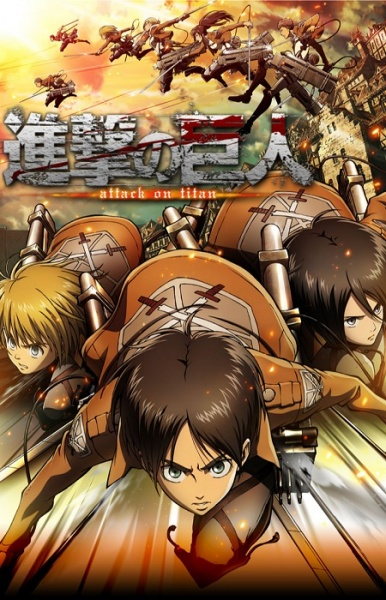

# Attack on Titan

## Resumo
A humanidade foi quase exterminada por criaturas gigantes conhecidas como Titãs. Os sobreviventes vivem há 100 anos em paz dentro de um país cercado por três muralhas concêntricas imensas. A paz é quebrada quando um "Titã Colossal" aparece do nada e destrói a muralha externa, permitindo que os titãs comuns invadam. Eren Yeager, um garoto que perde a mãe nesse ataque, jura exterminar todos os titãs. Ele se junta ao exército, mas a luta pela sobrevivência revelará segredos aterrorizantes sobre a origem dos titãs, a história do mundo e a verdadeira natureza do inimigo.

## Informações Importantes & Lore
* **Os Titãs:** Seres humanoides gigantes que não precisam comer ou beber, mas que devoram humanos instintivamente. Seu único ponto fraco é a nuca.
* **As Três Muralhas:** Maria (externa), Rose (meio) e Sina (interna). São objetos de adoração religiosa e guardam segredos obscuros do passado da humanidade.
* **DMT (Dispositivo de Movimentação Tridimensional):** Equipamento militar a gás que permite aos soldados se moverem em altas velocidades pelo ar, usando cabos e ganchos para combater os titãs nas alturas.
* **O Mistério do Porão:** O grande mistério do início da série, deixado pelo pai de Eren, que promete revelar a verdade sobre o mundo fora das muralhas.

## Comentários Pessoais do Alessandro
[Anotações baseadas na nossa conversa. O que você mais achou, o que odiou, momentos marcantes]

## Por que essa nota?
* **A história é inteligente:** [Nota/Justificativa]
* **Personagens chamam a atenção:** [Nota/Justificativa]
* **O anime é bem feito:** [Nota/Justificativa]
* **Foge dos clichês:** [Nota/Justificativa]
* **O ritmo não enrola:** [Nota/Justificativa]
* **Quão o final é satisfatório:** [Nota/Justificativa]
* **Boas sacadas:** [Nota/Justificativa]
* **Fator WOW:** [Nota/Justificativa]

## Links e Conexões
* **Animes similares:** [[Code Geass]]
* **Mesmo Estúdio/Diretor:** Estúdio [[Wit Studio]] (Temporadas 1 a 3) e [[MAPPA]] (Temporada Final)
* **Por que te lembra esse:** A partir de certo ponto, a trama vira um denso thriller político e militar de moralidade questionável, lembrando muito as táticas do Zero.