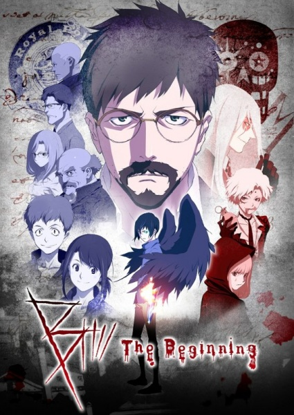

# B: The Beginning

## Comentários pessoais
[Anotações]

## Como a nota é calculada
* **A história é inteligente:** 
* **Personagens chamam a atenção:** 
* **O anime é bem feito:** 
* **Foge dos clichês:** 
* **O ritmo não enrola:** 
* **Quão o final é satisfatório:** 
* **Boas sacadas:** 
* **Fator WOW:** 

## Resumo
Em um mundo onde vampiros emergiram das sombras e coexistem com os humanos em uma sociedade fraturada, a história segue Kenshin, um vampiro poderoso que luta para manter sua humanidade enquanto é caçado implacavelmente por "Hunters" — humanos especializados em eliminar vampiros. A trama se desenrola em uma metrópole obscura e chuvosa, onde a linha entre o bem e o mal é turva. Kenshin, que já foi um lendário caçador de vampiros, agora busca um caminho de redenção enquanto protege uma jovem humana que detém a chave para um segredo que pode alterar o equilíbrio entre as duas raças. Ao mesmo tempo, um novo e misterioso Hunter aparece na cidade, desafiando todas as regras estabelecidas e forçando Kenshin a confrontar seu passado sombrio e as escolhas que o definem.

## Informações Importantes
* O universo da obra apresenta uma hierarquia vampírica rígida, onde os "Anciões" governam as facções e os vampiros mais jovens são subordinados, criando conflitos internos por poder e território.
* A tecnologia de "Arma de Luz" é a principal ferramenta dos Hunters para combater os vampiros, utilizando crispas de luz concentrada que podem ferir e até mesmo destruir seres imortais.
* A cidade onde a história se passa é um personagem em si: uma metrópole neo-noir, constantemente chuvosa, com becos sombrios e arranha-céus que abrigam tanto a alta sociedade vampírica quanto a marginalização humana.
* O "Sangue Real" é um conceito central: o sangue de vampiros antigos possui propriedades únicas que podem conceder poder imensurável ou maldições terríveis a quem o consome.
* A obra mistura elementos de ação frenética com reflexões filosóficas sobre o que significa ser humano, a natureza da imortalidade e a busca por redenção em um mundo onde a moralidade é relativa.

## Links e Conexões
* **Animes similares:** [Vampire Hunter D](vampire-hunter-d.md), [Hellsing](hellsing.md), [BLOOD+](blood-plus.md), [Seraph of the End](seraph-of-the-end.md)
* **Mesmo Estúdio/Diretor:** Estúdio Production I.G, direção de Yoshitaka Amano (design original) e colaboração criativa de Yoko Taro
* **Por que te lembra esse:** Compartilham atmosfera dark fantasy, protagonistas vampíricos ou caçadores de vampiros, mundo construído com regras sobrenaturais claras, ação intensa e uma estética visual marcante que mistura o clássico com o moderno.
