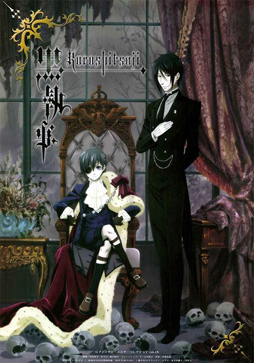

# Black Butler

## Comentários pessoais
[Anotações]

## Como a nota é calculada
* **A história é inteligente:** 
* **Personagens chamam a atenção:** 
* **O anime é bem feito:** 
* **Foge dos clichês:** 
* **O ritmo não enrola:** 
* **Quão o final é satisfatório:** 
* **Boas sacadas:** 
* **Fator WOW:** 

## Resumo
Na Inglaterra vitoriana, o jovem Ciel Phantomhive atua como o "Cão de Guarda da Rainha", resolvendo incidentes perturbadores que ameaçam a coroa. Ele é auxiliado por Sebastian Michaelis, um mordomo de habilidades desumanas que é, na verdade, um demônio com quem Ciel firmou um contrato: Sebastian serve ao jovem em troca de sua alma após a vingança contra aqueles que arruinaram sua família ser concluída. A relação entre mestre e servo torna-se um elo inquebrável enquanto eles desvendam conspirações obscuras.

## Informações Importantes
* Baseado no popular mangá de Yana Toboso.
* A série é famosa por seu tom gótico, humor sombrio e estética vitoriana detalhada.
* Produzido pelo estúdio A-1 Pictures.
* A dinâmica entre o astuto Ciel e o enigmático Sebastian é o coração narrativo, explorando temas de sacrifício e retribuição.

## Links e Conexões
* **Animes similares:** [Pandora Hearts](pandora-hearts.md), [D.Gray-man](dgray-man.md), [Death Note](death-note.md)
* **Mesmo Estúdio/Diretor:** Estúdio [A-1 Pictures](a-1-pictures.md)
* **Por que te lembra esse:** Pela ambientação histórica misteriosa, foco em tramas sobrenaturais complexas e a presença de protagonistas inteligentes em busca de vingança.
