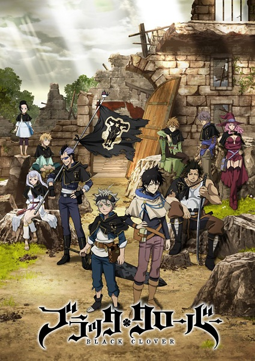

# Black Clover

## Comentários pessoais
[Anotações]

## Como a nota é calculada
* **A história é inteligente:** 
* **Personagens chamam a atenção:** 
* **O anime é bem feito:** 
* **Foge dos clichês:** 
* **O ritmo não enrola:** 
* **Quão o final é satisfatório:** 
* **Boas sacadas:** 
* **Fator WOW:** 

## Resumo
Asta e Yuno foram abandonados na mesma igreja no mesmo dia. Criados juntos, eles conheceram o "Rei Mago" — um título dado ao mago mais forte do reino — e prometeram que competiriam um contra o outro pelo cargo. No entanto, ao crescerem, a diferença entre eles tornou-se evidente. Enquanto Yuno consegue wieldar magia com poder e controle incríveis, Asta não consegue usar magia nenhuma e tenta desesperadamente despertar seus poderes através de treinamento físico. Ao completarem 15 anos, Yuno recebe um Grimório espetacular com um trevo de quatro folhas, enquanto Asta não recebe nada. Porém, logo depois, Yuno é atacado por Lebuty, cujo objetivo principal é obter o Grimório de Yuno. Asta tenta lutar, mas é superado. Embora sem esperança e à beira da derrota, ele encontra forças para continuar ao ouvir a voz de Yuno. Despertando suas emoções internas em fúria, Asta recebe um Grimório de trevo de cinco folhas, um "Black Clover", dando-lhe poder suficiente para derrotar Lebuty. Poucos dias depois, os dois amigos partem para o mundo, ambos buscando o mesmo objetivo — tornarem-se o Rei Mago!

## Informações Importantes
* **Sistema de Magia:** Todos no mundo de Black Clover possuem Mana. A quantidade e o tipo de magia determinam a força do indivíduo. Asta é a exceção única que nasceu sem nenhuma Mana.
* **Grimórios:** Livros mágicos que amplificam as habilidades do usuário. Eles escolhem seus donos. O número de folhas no trevo da capa indica a raridade e potencial (3 folhas = comum, 4 = raro, 5 = trevo negro/amaldiçoado ligado a demônios).
* **Reino de Clover:** O cenário principal, dividido em vários reinos menores, protegido por Cavaleiros Mágicos (Magic Knights) divididos em esquadrões (Golden Dawn, Black Bulls, etc.).
* **Anti-Magia de Asta:** Seu espadão (dado pelo demônio em seu grimório de 5 folhas) possui a capacidade única de negar e cortar qualquer tipo de magia, tornando-o forte contra magos poderosos.
* **Elves e Demônios:** A história revela camadas profundas de preconceito, guerra civil entre raças (elfos vs humanos) e pactos sombrios com seres de outras dimensões.

## Links e Conexões
* **Animes similares:** [My Hero Academia](my-hero-academia.md), [Naruto](https://myanimelist.net/anime/1535/Naruto), [Bleach](https://myanimelist.net/anime/269/Bleach)
* **Mesmo Estúdio/Diretor:** Estúdio [Pierrot](https://myanimelist.net/anime/producer/1/Pierrot) (conhecido por Naruto e Bleach)
* **Por que te lembra esse:** O clássico "underdog" (azarão) que nasce sem poderes em um mundo de magia, mas supera todos com esforço bruto e determinação, muito similar à jornada de Naruto ou Deku.
