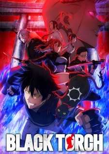

# Black Torch

## Comentários pessoais
Anime assistido via Crunchyroll. A trama central segue Jirou Azuma, um adolescente que herda o poder de falar com animais e desenvolve uma parceria com um mononoke (espírito animal) chamado Ragou após um acidente mortal. A combinação de forças resulta no surgimento de um novo herói mascarado, Black Torch, que caça entidades malignas que ameaçam a humanidade. O anime apresenta uma premissa relativamente original dentro do gênero de heróis mascarados, combinando elementos sobrenaturais com características típicas de shounen.

## Como a nota é calculada
* **A história é inteligente:** 4
* **Personagens chamam a atenção:** 5
* **O anime é bem feito:** 5
* **Foge dos clichês:** 4
* **O ritmo não enrola:** 5
* **Quão o final é satisfatório:** 3
* **Boas sacadas:** 4
* **Fator WOW:** 4

## Resumo
Na história, Jirou Azuma vive uma vida tranquila ao lado de seu avô até que seu destino muda drasticamente após resgatar um gato negro misterioso. Esse animal revela-se ser Ragou, um mononoke (espírito demoníaco) em guerra contra a humanidade. Após Jirou salvar Ragou da morte, ele recebe poderes sobrenaturais do espírito, ganhando habilidades únicas e uma força extraordinária. Agora equipado com esses poderes, Jirou busca se tornar o herói definitivo capaz de proteger as pessoas que ama e lutar contra as criaturas malignas que ameaçam o mundo.

## Informações Importantes
* **Título original (MAL):** BLACK TORCH.
* **Fonte:** Light novel (adaptação de web novel?) publicada pela Kadokawa Shoten.
* **Estúdio:** 100studio (responsável por animações como "Gochuumon wa Usagi Desuka?" e "Sakurada Rentō.").
* **Temporada:** Verão 2026 (estratégia confirmada de exibição).
* **Episódios:** 12 (23 min cada, finalizado em 20/10/2026).
* **Classificação:** PG-13 — Teens 13 or older.
* **Gênero principal:** Action/Supnatural com elementos de Shounen.
* **Status de transmissão:** Finalizado; disponível no Crunchyroll e plataformas compatíveis.
* **Produção:** Shogakukan-Shueisha Productions, Delfi Sound, Shueisha, Hike.
* **Licenciadores:** VIZ Media ( licenciam obras japonesas para mercados ocidentais).
* **Sistema do mundo:** Mundo onde coexistimos com espíritos e entidades sobrenaturais; a humanidade mantém uma organização secreta para proteger as pessoas e neutralizar as ameaças.
* **Ponto-chave:** A fusão de poderes entre humano e mononoke cria um novo arquétipo de herói, diferentes dos demais shounen tradicionais.

## Links e Conexões
* **Animes similares:** [One Punch Man](one-punch-man.md) (protagonista que evolui para poder dizer "eu já entendi"), [Code Geass](code-geass.md) (heroísmo mascarado), [Jujutsu Kaisen](jujutsu-kaisen.md) (seres sobrenaturais)
* **Mesmo Estúdio/Diretor:** Estúdio [100studio](https://myanimelist.net/anime/producer/1593/100studio) — conhecido por obras focadas em heróis mascarados e aventuras.
* **Por que te lembra esse:** O tema central de humanos com habilidades extraordinárias que lutam contra o mal para proteger as pessoas lembram muitos shounen; a mecânica de "mononoke" de Black Torch traz uma nova dimensão para o gênero de heróis mascarados.
