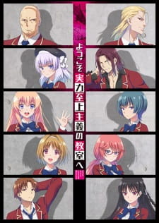

# Classroom of the Elite

## Comentários pessoais
Anime extremamente inteligente com um protagonista de nível excepcional — Kiyotaka Ayanokōji é um gênio que deliberadamente se esconde atrás de uma fachada medíocre. A premissa de uma escola elitista onde a inteligência é medida e manipulada gera tensão constante e reviravoltas surpreendentes. O maior diferencial é explorar a dificuldade do protagonista em processar emoções, criando um personagem fascinante e enigmático.

A primeira temporada é brilhante, com ritmo impecável e construção de mistério excelente. A segunda temporada, porém, perde consideravelmente o ritmo e o encanto — os desafios se tornam previsíveis e a dinâmica de grupo perde a urgência da primeira temporada. Ainda assim, o conjunto é sólido e merece atenção.

## Como a nota é calculada
* **A história é inteligente:** 8
* **Personagens chamam a atenção:** 7
* **O anime é bem feito:** 7
* **Foge dos clichês:** 6
* **O ritmo não enrola:** 7
* **Quão o final é satisfatório:** 7
* **Boas sacadas:** 8
* **Fator WOW:** 7

## Resumo
A Escola Privado Advanced Número 1 é uma instituição de elite onde os alunos competem por status e privilégios. Kiyotaka Ayanokōji, um estudante misteriosamente talentoso, se encontra na Turma D — a mais negligenciada. Com aliados improváveis, ele precisa navegar por batalhas psicológicas, triagens de classe e segredos sombrios da escola, tudo enquanto luta para entender suas próprias emoções.

## Informações Importantes
* **Título oficial (MAL):** Youkoso Jitsuryoku Shijou Shugi no Kyoushitsu e (Welcome to the Classroom of the Elite).
* **Título em inglês:** Classroom of the Elite (You-Zitsu).
* **Fonte:** Light novel publicada pela Media Factory (Kadokawa).
* **Estúdio:** Lerche (responsável por Assassination Classroom, Haruhi Suzumiya).
* **Temporada:** Verão 2017 (1ª temporada); Janeiro 2022 (2ª temporada); Janeiro 2024 (3ª temporada).
* **Episódios:** 12 por temporada (23 min cada).
* **Classificação:** R — 17+ (violência, linguagem forte, conteúdo psicológico).
* **Gênero principal:** Ação, Comédia, Drama, Escola, Suspense.
* **Status de transmissão:** Finalizado (3 temporadas).
* **Produção:** Lerche.
* **Licenciadores:** Crunchyroll (global).
* **Sistema do mundo:** Sistema de classes na escola onde a posição determina privilégios e recursos; alunos podem ser rebaixados ou promovidos baseados em pontos e desempenho.
* **Ponto-chave:** Protagonista de inteligência excepcional que deliberadamente suprime suas habilidades e luta para sentir emoções genuínas, num ambiente escolar que é mais um campo de batalha psicológica do que um lugar de aprendizado.
* **Observação técnica:** Animação funcional, com direção de animação competentes nas cenas de tensão. A 1ª temporada (TMS Entertainment) tem visual superior à 2ª temporada (Lerche).

## Links e Conexões
* **Animes similares:** [Mushoku Tensei: Jobless Reincarnation](mushoku-tensei-jobless-reincarnation.md) (protagonista com habilidades excepcionais num ambiente estruturado), [The Exiled Heavy Knight Knows How to Game the System](the-exiled-heavy-knight-knows-how-to-game-the-system.md) (protagonista que esconde suas reais capacidades), [Trapped in a Dating Sim](trapped-in-a-dating-sim.md) (protagonista com conhecimento prévio num sistema)
* **Mesmo Estúdio/Diretor:** Estúdio [Lerche](https://myanimelist.net/anime/producer/1457/Lerche).
* **Por que te lembra esse:** O conceito de protagonista de poder oculto num sistema competitivo, misturado com elementos psicológicos e reviravoltas, é único e difícil de encontrar em outros animes.
