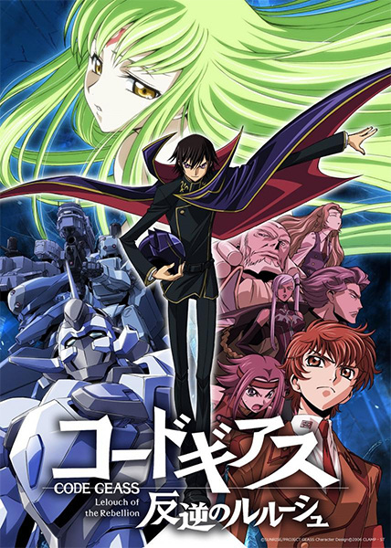

# Code Geass: Lelouch of the Rebellion

## Comentários pessoais
Sem dúvida mais um anime na linha de Death Note. Muito inteligente e com várias sacadas na vida humana, social e existencial.

## Como a nota é calculada
* **A história é inteligente:** 
* **Personagens chamam a atenção:** 
* **O anime é bem feito:** 
* **Foge dos clichês:** 
* **O ritmo não enrola:** 
* **Quão o final é satisfatório:** 
* **Boas sacadas:** 
* **Fator WOW:** 

## Resumo
Lelouch vi Britannia, um príncipe exilado do Sacro Império de Britannia, recebe um poder misterioso conhecido como "Geass" de uma garota chamada C.C. Esse poder lhe permite dar uma ordem absoluta a qualquer pessoa, a qual é obedecida sem questionamentos. Com essa nova habilidade, ele assume a identidade secreta de "Zero" e lidera a resistência japonesa para derrubar o império que o traiu, buscando vingança e um mundo melhor para sua irmã.

## Informações Importantes
* **O Geass:** Um poder sobrenatural dado por seres chamados "Bruxas". Ele se manifesta de forma diferente para cada pessoa; no caso de Lelouch, é a "Poder da Obediência Absoluta".
* **Knightmare Frames:** Robôs de combate humanoides usados pelo exército de Britannia e pelas forças de resistência. São a base das batalhas táticas do anime.
* **Sacro Império de Britannia:** A superpotência mundial que conquistou o Japão, rebatizando-o de "Área 11" e tratando seus habitantes como cidadãos de segunda classe (chamados pejorativamente de "Elevens").
* **A Dualidade de Lelouch:** O anime explora constantemente o conflito interno entre a sua vida como um estudante comum e sua faceta implacável como o líder revolucionário Zero.

## Links e Conexões
* **Animes similares:** [[Death Note]]
* **Mesmo Estúdio/Diretor:** Estúdio [[Sunrise]] / Diretor [[Gorō Taniguchi]] (Design de personagens por [[CLAMP]])
* **Por que te lembra esse:** Ambos possuem protagonistas geniais em batalhas mentais contra um sistema opressor.