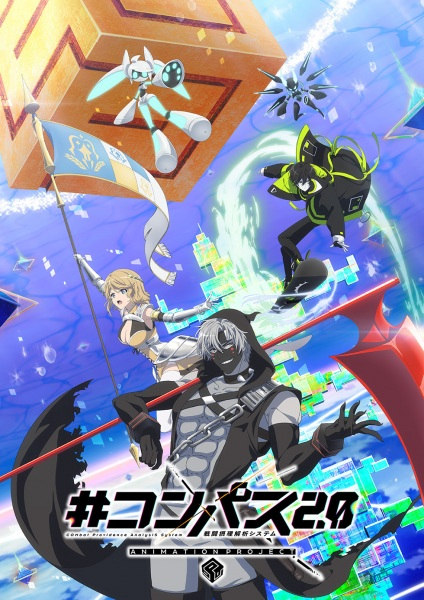

# #Compass2.0: Animation Project

## Comentários pessoais
[Anotações]

## Como a nota é calculada
* **A história é inteligente:** 
* **Personagens chamam a atenção:** 
* **O anime é bem feito:** 
* **Foge dos clichês:** 
* **O ritmo não enrola:** 
* **Quão o final é satisfatório:** 
* **Boas sacadas:** 
* **Fator WOW:** 

## Resumo
Baseado no sistema de análise de batalhas "#Compass 2.0", a história se passa em um espaço onírico onde heróis de diferentes mundos interagem com jogadores humanos. A energia gerada por essas batalhas é vital para o sistema. O enredo foca no herói problemático "13", que se recusa a lutar ou encontrar um parceiro, enfrentando o risco de ser banido do mundo de #Compass, até que um jogador iniciante chamado Jin demonstra interesse em se tornar seu parceiro.

## Informações Importantes
* O anime é uma adaptação de um jogo mobile desenvolvido pela NHN PlayArt e Dwango.
* A premissa gira em torno da colaboração entre heróis e jogadores em um ambiente de arena virtual.
* A animação é produzida pelo estúdio Lay-duce.
* A série explora conflitos e eventos dentro do sistema de análise de combate.

## Links e Conexões
* **Animes similares:** [ ]
* **Mesmo Estúdio/Diretor:** Estúdio [Lay-duce](lay-duce.md)
* **Por que te lembra esse:** [ ]
