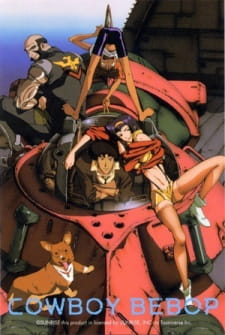

# Cowboy Bebop

## Comentários pessoais
[Anotações]

## Como a nota é calculada
* **A história é inteligente:** 
* **Personagens chamam a atenção:** 
* **O anime é bem feito:** 
* **Foge dos clichês:** 
* **O ritmo não enrola:** 
* **Quão o final é satisfatório:** 
* **Boas sacadas:** 
* **Fator WOW:** 

## Resumo
No ano de 2071, a humanidade colonizou a maior parte do Sistema Solar, com a Aliança Espacial Unida responsável por policiar as rotas espaciais. No entanto, a organização está sobrecarregada com a crescente atividade criminosa que assombra as colônias. É neste cenário que surge a Bebop, uma nave espacial tripulada por um grupo de caçadores de recompensas — os chamados "cowboys" — que lutam para ganhar a vida perseguindo criminosos procurados. A tripulação é formada por Spike Spiegel, um ex-hitman habilidoso em artes marciais; Jet Black, um ex-policial que agora é um ciborgue; Faye Valentine, uma mulher misteriosa acordada de um sono criogênico após décadas; Ed, uma jovem hacker excêntrica; e Ein, um corgi bioengenheirado com inteligência de nível humano. Juntos, eles atravessam a galáxia, perseguindo recompensas e sendo forçados a confrontar os fantasmas de seus próprios passados.

## Informações Importantes
* O sistema de recompensas do universo de *Cowboy Bebop* é gerido pela Aliança Espacial Unida, onde criminosos perigosos têm bounties (recompensas) em créditos espaciais, servindo como a principal fonte de renda precária dos "cowboys".
* A nave Bebop é uma aeronave antiga convertida em base de operações, com um design retro-futurista que mistura elementos dos anos 1970 com tecnologia avançada do século XXI.
* A bioengenharia e a inteligência artificial são elementos centrais do universo: Ein é um cão geneticamente modificado para possuir raciocínio humano, enquanto Jet Black utiliza membros cibernéticos após perder o braço em uma missão policial corrupta.
* A expansão humana para o Sistema Solar ocorreu após a Terra se tornar parcialmente inabitável, levando à formação de colônias em Marte, Vênus e satélites naturais, com uma infraestrutura precária que favorece o crime organizado.
* A trilha sonora da obra, composta por Yoko Kanno, mistura jazz, blues, rock e música eletrônica, criando uma atmosfera única que complementa a narrativa não linear e o desenvolvimento emocional dos personagens.

## Links e Conexões
* **Animes similares:** [Samurai Champloo](samurai-champloo.md), [Trigun](trigun.md), [Black Lagoon](black-lagoon.md), [Space☆Dandy](space-dandy.md)
* **Mesmo Estúdio/Diretor:** Estúdio [Sunrise](https://myanimelist.net/anime/producer/14/Sunrise), direção de Shinichirō Watanabe
* **Por que te lembra esse:** Compartilham o mesmo estilo de narrativa focada em personagens marginais, trilhas sonoras marcantes que definem o tom da obra e uma estética retro-futurista única.
