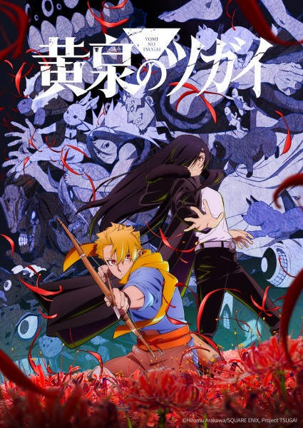

# Daemons of the Shadow Realm

## Comentários pessoais
[Anotações]

## Como a nota é calculada
* **A história é inteligente:** 
* **Personagens chamam a atenção:** 
* **O anime é bem feito:** 
* **Foge dos clichês:** 
* **O ritmo não enrola:** 
* **Quão o final é satisfatório:** 
* **Boas sacadas:** 
* **Fator WOW:** 

## Resumo
Em um vilarejo isolado, gêmeos nasceram separados pelo dia e pela noite. Anos depois, Yuru vive como um caçador, enquanto sua irmã, Asa, é mantida em uma cela para cumprir um dever especial. A tranquilidade é quebrada quando um grupo armado invade o vilarejo em busca de Yuru. Ao tentar fugir com sua irmã, Yuru descobre que ela foi assassinada e que uma mulher que alega ser sua verdadeira irmã gêmea está atrás dele. Socorrido por um visitante do vilarejo, Yuru é forçado a invocar os "Tsugai", entidades sobrenaturais ligadas ao seu destino, para desvendar a verdade por trás desse caos.

## Informações Importantes
* Obra da mesma autora de *Fullmetal Alchemist*, Hiromu Arakawa.
* O título original, *Yomi no Tsugai*, faz referência direta aos conceitos de "Tsugai" (pares/casais) e ao submundo (Yomi).
* A animação é produzida pelo renomado estúdio *Bones*.
* A premissa gira em torno de gêmeos predestinados e o uso de entidades chamadas *Tsugai* em um mundo moderno que oculta elementos mágicos.

## Links e Conexões
* **Animes similares:** [Fullmetal Alchemist: Brotherhood](fullmetal-acemist-brotherhood.md), [Noragami](noragami.md)
* **Mesmo Estúdio/Diretor:** Estúdio [Bones](bones.md)
* **Por que te lembra esse:** Pelo traço característico da autora e pela construção de um sistema de poder único baseado em parcerias sobrenaturais.
