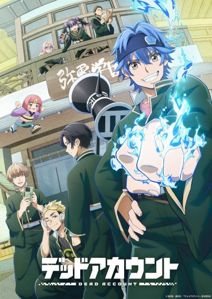

# Dead Account

## Comentários pessoais
[Anotações]

## Como a nota é calculada
* **A história é inteligente:** 
* **Personagens chamam a atenção:** 
* **O anime é bem feito:** 
* **Foge dos clichês:** 
* **O ritmo não enrola:** 
* **Quão o final é satisfatório:** 
* **Boas sacadas:** 
* **Fator WOW:** 

## Resumo
Souji Enishiro, um estudante que abandonou o ensino médio, vive uma vida dupla: enquanto se dedica a cuidar de sua irmã doente, ele atua como o streamer de internet "Aoringo". Como Aoringo, ele é um *troll* polêmico que gera conteúdo extremo para obter receita através de espectadores que o odeiam. No entanto, quando eventos bizarros começam a ocorrer, sua persona online se torna o centro de uma batalha sobrenatural inesperada.

## Informações Importantes
* O anime é uma adaptação de um mangá shounen publicado pela Kodansha.
* Explora o contraste entre a vida comum, focada na família, e o submundo do streaming extremo.
* A animação é produzida pelo estúdio SynergySP.
* A premissa combina temas de horror oculto e batalhas com uma crítica à cultura de streaming moderno.

## Links e Conexões
* **Animes similares:** [Parasyte: The Maxim](parasyte.md), [Tokyo Ghoul](tokyo-ghoul.md)
* **Mesmo Estúdio/Diretor:** Estúdio [SynergySP](synergy-sp.md)
* **Por que te lembra esse:** Pela vida dupla do protagonista e a abordagem de elementos sobrenaturais no mundo contemporâneo.
