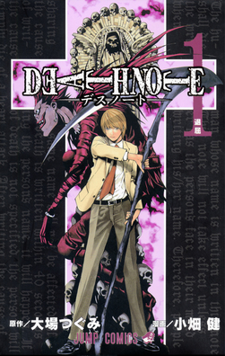

# Death Note

## Resumo (Gerado por IA)
A história acompanha Light Yagami, um estudante brilhante e entediado que encontra um caderno sobrenatural chamado "Death Note", deixado cair por um Shinigami (deus da morte) chamado Ryuk. O caderno tem o poder de matar qualquer pessoa cujo nome seja escrito nele, desde que o portador visualize o rosto da vítima. Light decide usar o caderno para erradicar criminosos e criar um "novo mundo" livre do mal, governado por ele sob a alcunha de "Kira". No entanto, suas ações chamam a atenção da Interpol e de um detetive genial e excêntrico conhecido apenas como "L". Começa então um intenso jogo de gato e rato entre os dois.

## Informações Importantes & Lore
* **O Death Note:** Um caderno de capa preta com regras estritas. A regra principal: "O humano cujo nome for escrito neste caderno morrerá". O feitiço só funciona se o escritor tiver o rosto da pessoa em mente, prevenindo que pessoas com o mesmo nome morram por engano.
* **Shinigami (Deuses da Morte):** Seres de outra dimensão que estendem suas próprias vidas escrevendo o nome de humanos em seus cadernos. Ryuk, o Shinigami de Light, deixou seu caderno cair no mundo humano apenas por tédio.
* **Regras de Causa da Morte:** Se a causa da morte for escrita em até 40 segundos após o nome, ela acontecerá. Caso contrário, a vítima morrerá de ataque cardíaco. Pode-se também especificar os detalhes da morte.
* **Acordo dos Olhos de Shinigami:** Um humano com um Death Note pode trocar metade de sua expectativa de vida restante pelos "Olhos de Shinigami", que permitem ver o nome e o tempo de vida de qualquer pessoa apenas olhando para o rosto dela.

## Comentários Pessoais do Alessandro
[Adicione aqui seus comentários: o que achou da jornada do Light? E a rivalidade com o L?]

## Por que essa nota?
* **A história é inteligente:** Nota 10. A trama é extremamente inteligente e traz ótimas sacadas sobre o comportamento humano, mantendo-se atual até os dias de hoje.
* **Personagens chamam a atenção:** Nota 10. Todos os personagens cumprem bem seu papel e grande destaque para os personagens principais.
* **O anime é bem feito:** Nota 8. Para a época podemos considerar, mas mesmo assim havia outros animes com mais qualidade já nesses tempos.
* **Foge dos clichês:** Nota 10 com certeza.
* **O ritmo não enrola:** Nota 10.
* **Quão o final é satisfatório:** Nota 10. Perfeito.
* **Boas sacadas:** Nota 10. O anime é recheado de insights geniais sobre a natureza humana e estratégias surpreendentes.
* **Fator WOW:** Nota 10. Constantemente temos isso nesse anime.

## Links e Conexões
* [Quais animes te lembram Death Note? Talvez Code Geass?]