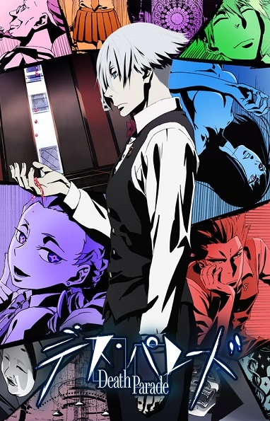

# Death Parade

## Comentários pessoais
[Anotações baseadas na nossa conversa. O que você mais achou, o que odiou, momentos marcantes]

## Como a nota é calculada
* **A história é inteligente:** 
* **Personagens chamam a atenção:** 
* **O anime é bem feito:** 
* **Foge dos clichês:** 
* **O ritmo não enrola:** 
* **Quão o final é satisfatório:** 
* **Boas sacadas:** 
* **Fator WOW:** 

## Resumo
Quando duas pessoas morrem ao mesmo tempo, elas não vão direto para o céu ou para o inferno. Elas são enviadas a bares misteriosos administrados por seres conhecidos como "Árbitros". O bar Quindecim é gerenciado por Decim, um árbitro de cabelos brancos e postura impecável. Lá, ele desafia os recém-falecidos — que não lembram que morreram — a participar de jogos de bar aparentemente simples (como dardos, bilhar ou boliche), onde a aposta é supostamente a vida deles. Sob a tensão extrema desses "Death Games", a verdadeira natureza e a escuridão dos indivíduos vêm à tona, e Decim usa essas informações para julgá-los: enviar a alma para a reencarnação ou condená-la ao Vazio.

## Informações Importantes
* **O Quindecim:** Um luxuoso bar localizado no purgatório, que serve como o palco principal dos julgamentos.
* **Os Árbitros (Decim):** Entidades criadas para julgar os humanos. A regra de ouro é que os árbitros não podem viver, nem morrer, nem experimentar emoções humanas, para que seus julgamentos sejam totalmente "imparciais".
* **Os Death Games:** Os jogos são manipulados com sensores neurais e físicos (por exemplo, acertar o alvo dos dardos causa dor num órgão do oponente). A dor e o desespero servem apenas para arrancar a máscara social dos participantes e mostrar quem eles realmente são.
* **Reencarnação vs. O Vazio:** Reencarnar significa voltar à roda da vida com outra identidade. Cair no Vazio é o verdadeiro terror: ser lançado no escuro e no nada por toda a eternidade.

## Links e Conexões
* **Animes similares:** [Death Note](death-note.md), [Psycho-Pass](psycho-pass.md)
* **Mesmo Estúdio/Diretor:** Estúdio [Madhouse](madhouse.md) / Diretor [Yuzuru Tachikawa](yuzuru-tachikawa.md)
* **Por que te lembra esse:** Jogos de alta tensão revelando a verdadeira faceta da psicologia humana. A conexão com o estúdio de Death Note é claríssima na arte e no tom maduro.