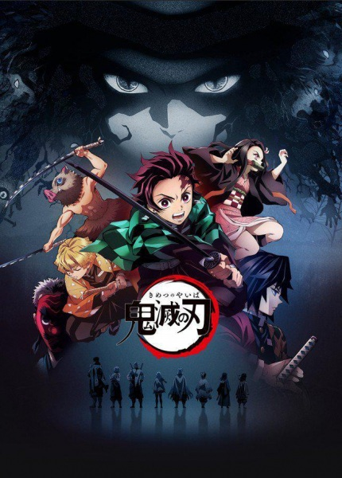

     1|---
     2|titulo: "Kimetsu no Yaiba"
     3|titulo_original: "鬼滅の刃"
     4|ano: "2019"
     5|genero:
     6|  - Action
     7|  - Award Winning
     8|  - Supernatural
     9|tags: []
    10|status: "Assistido"
    11|assistido: ""
    12|nota final: ""
    13|link_referencia: "https://myanimelist.net/anime/38000/Kimetsu_no_Yaiba"
    14|veredito_rapido: ""
    15|---
    16|
    17|# Demon Slayer: Kimetsu no Yaiba
    18|
    19|
    20|
    21|## Comentários pessoais
    22|[Anotações]
    23|
    24|## Como a nota é calculada
    25|* **A história é inteligente:** 
    26|* **Personagens chamam a atenção:** 
    27|* **O anime é bem feito:** 
    28|* **Foge dos clichês:** 
    29|* **O ritmo não enrola:** 
    30|* **Quão o final é satisfatório:** 
    31|* **Boas sacadas:** 
    32|* **Fator WOW:** 
    33|
    34|## Resumo
    35|Ever since the death of his father, the burden of supporting the family has fallen upon Tanjirou Kamado's shoulders. Though living impoverished on a remote mountain, the Kamado family are able to enjoy a relatively peaceful and happy life. One day, Tanjirou decides to go down to the local village to make a little money selling charcoal. On his way back, night falls, forcing Tanjirou to take shelter in the house of a strange man, who warns him of the existence of flesh-eating demons that lurk in the woods at night.
    36|
    37|When he finally arrives back home the next day, he is met with a horrifying sight—his whole family has been slaughtered. Worse still, the sole survivor is his sister Nezuko, who has been turned into a bloodthirsty demon. Consumed by rage and hatred, Tanjirou swears to avenge his family and stay by his only remaining sibling. Alongside the mysterious group calling themselves the Demon Slayer Corps, Tanjirou will do whatever it takes to slay the demons and protect the remnants of his beloved sister's humanity.
    38|
    39|[Written by MAL Rewrite]
    40|
    41|
    42|
    43|## Informações Importantes
    44|* **Respirações:** Sistema de combate baseado em estilos de respiração.
    45|* **Poderes:** Habilidades demoníacas e técnicas de espadachim.
    46|* **Temática:** Vingança, laços familiares e superação de perdas.
    47|
    48|
    49|
    50|## Links e Conexões
    51|* **Animes similares:** [Jujutsu Kaisen](jujutsu-kaisen.md), [Bleach](bleach.md)
    52|* **Mesmo Estúdio/Diretor:** Estúdio [ufotable](ufotable.md)
    53|* **Por que te lembra esse:** Sistema de combate estilizado e temática de vingança familiar.
    54|* **Mesmo Estúdio/Diretor:** 
    55|* **Por que te lembra esse:** [Breve explicação]
    56|