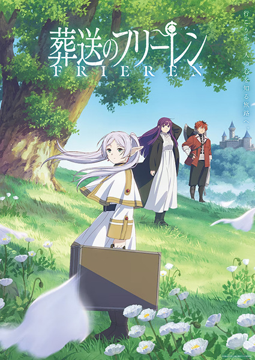

     1|---
     2|titulo: "Sousou no Frieren"
     3|titulo_original: "葬送のフリーレン"
     4|ano: "2023"
     5|genero:
     6|  - Adventure
     7|  - Award Winning
     8|  - Drama
     9|  - Fantasy
    10|tags: []
    11|status: "Assistido"
    12|assistido: ""
    13|nota final: ""
    14|link_referencia: "https://myanimelist.net/anime/52991/Sousou_no_Frieren"
    15|veredito_rapido: ""
    16|---
    17|
    18|# Frieren: Beyond Journey's End
    19|
    20|
    21|
    22|## Comentários pessoais
    23|[Anotações]
    24|
    25|## Como a nota é calculada
    26|* **A história é inteligente:** 
    27|* **Personagens chamam a atenção:** 
    28|* **O anime é bem feito:** 
    29|* **Foge dos clichês:** 
    30|* **O ritmo não enrola:** 
    31|* **Quão o final é satisfatório:** 
    32|* **Boas sacadas:** 
    33|* **Fator WOW:** 
    34|
    35|## Resumo
    36|Durante a década de busca para derrotar o Rei Demônio, os membros do grupo de heróis—Himmel himself, the priest Heiter, the guerreiro anão Eisen, and the maga élfica Frieren—formam laços através de aventuras e batalhas, criando memórias preciosas e inesquecíveis for most of them.
    37|
    38|However, o tempo que Frieren passa com seus companheiros equivale a apenas uma fração de sua vida, que dura há mais de mil anos. Quando o grupo se dissolve após a vitória, Frieren casualmente retorna à sua rotina "usual"' de coletar feitiços pelo continentee. Devido ao seu sentido diferente de tempo, ela aparentemente não tem sentimentos fortes pelas experiências que passou.
    39|
    40|Com o passar dos anos, Frieren gradualmente percebe como seus dias no grupo de heróis realmente a impactaram. Testemunhando as mortes de dois de seus antigos companheiros, Frieren começa a se arrepender de ter dado sua presença como garantida; ela jura entender melhor os humanos e criar conexões pessoais reais. Although the story of that once memorable journey has long ended, a new tale is about to begin.
    41|
    42|[Written by MAL Rewrite]
    43|
    44|
    45|
    46|## Informações Importantes
    47|* **O peso do tempo:** A obra foca na perspectiva de uma elfa para quem décadas são apenas instantes.
    48|* **Magia:** O sistema de magia é baseado em estudo e conhecimento, não apenas poder bruto.
    49|* **Temática:** Reflexão sobre luto, memória e a importância de criar conexões.
    50|
    51|
    52|
    53|## Links e Conexões
    54|* **Animes similares:** [The Apothecary Diaries](the-apothecary-diaries.md), [Mushishi](mushishi.md)
    55|* **Mesmo Estúdio/Diretor:** Estúdio [Madhouse](madhouse.md)
    56|* **Por que te lembra esse:** A atmosfera contemplativa e o foco em uma protagonista feminina extremamente competente.
    57|* **Mesmo Estúdio/Diretor:** 
    58|* **Por que te lembra esse:** [Breve explicação]
    59|