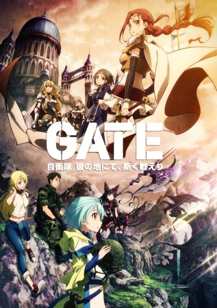

# Gate: Thus the JSDF Fought There!

## Comentários pessoais
[Anotações baseadas na nossa conversa. O que você mais achou, o que odiou, momentos marcantes]

## Como a nota é calculada
* **A história é inteligente:** 
* **Personagens chamam a atenção:** 
* **O anime é bem feito:** 
* **Foge dos clichês:** 
* **O ritmo não enrola:** 
* **Quão o final é satisfatório:** 
* **Boas sacadas:** 
* **Fator WOW:** 

## Resumo
Um portal misterioso chamado "Gate" se abre no meio de Ginza, Tóquio, conectando o mundo moderno ao mundo fantástico de "Special Region". A Força de Autodefesa do Japão (JSDF) entra no portal e estabelece uma base, encontrando elfos, dragões, impérios antigos e magia. O protagonista, Coronel Yōji Itami, lidera operações de paz enquanto navega por intrigas políticas entre o Império e o Japão.

## Informações Importantes
* **Special Region (Região Especial):** Mundo medieval fantástico com magia, dragões, elfos e impérios autoritários.
* **JSDF (Força de Autodefesa do Japão):** Tecnologia moderna vs. magia medieval cria um desequilíbrio de poder absurdo.
* **Império:** Antagonista principal que subestima a tecnologia moderna e paga caro por isso.
* **O "Gate":** Portal interdimensional que conecta os dois mundos, localizado em Ginza.

## Links e Conexões
* **Animes similares:** [Shin Mai no Ouji-sama](shin-mai-no-ouji-sama.md) (fantasia militar), [Youjo Senki](youjo-senki.md) (militar+fantasia)
* **Mesmo Estúdio/Diretor:** Estúdio A-1 Pictures / Diretor Takahiko Kyōgoku
* **Por que te lembra esse:** Isekai invertido onde o mundo moderno domina o mundo fantasy, com críticas políticas e militares inteligentes.
