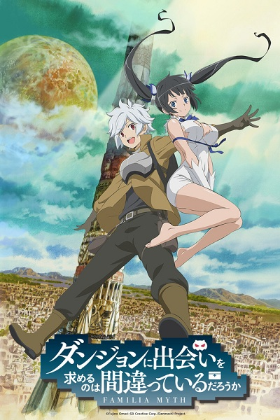

# Is It Wrong to Try to Pick Up Girls in a Dungeon?

## Comentários pessoais
[Anotações baseadas na nossa conversa. O que você mais achou, o que odiou, momentos marcantes]

## Como a nota é calculada
* **A história é inteligente:** 
* **Personagens chamam a atenção:** 
* **O anime é bem feito:** 
* **Foge dos clichês:** 
* **O ritmo não enrola:** 
* **Quão o final é satisfatório:** 
* **Boas sacadas:** 
* **Fator WOW:** 

## Resumo
Bell Cranel é um aventureiro solitário de nível 1 que sonha em se tornar um herói lendário. Ele é o único membro da Família Hestia, uma deusa caída que luta para apoiá-lo. Enquanto explora a masmorra, Bell encontra monstros, faz aliados inusitados e atrai a atenção de deusas, aventureiros e até mesmo da deusa da beleza, Freya. Uma história de crescimento pessoal em um mundo inspirado em RPGs.

## Informações Importantes
* **Famílias:** Grupos liderados por deuses que concedem habilidades especiais aos seus membros (Hestia Familia, Loki Familia, etc).
* **Masmorra (Dungeon):** Labirinto gerado magicamente que surge do chão, repleto de monstros e tesouros.
* **Level Up:** Aventureiros sobem de nível ao acumular experiência, desbloqueando novas habilidades.
* **Deuses (Gods):** Seres divinos que desceram à terra e formam laços com humanos através das Famílias.

## Links e Conexões
* **Animes similares:** [Sword Art Online](sword-art-online.md) (RPG+fantasia), [Log Horizon](log-horizon.md) (mundo de jogo)
* **Mesmo Estúdio/Diretor:** Estúdio J.C.Staff / Diretor Yoshiki Yamakawa
* **Por que te lembra esse:** Uma aventura clássica de RPG com um protagonista carismático e um sistema de crescimento viciante.
