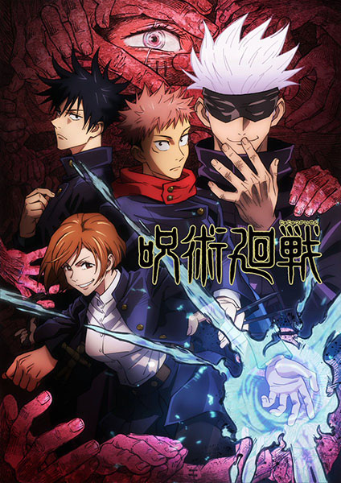

# Jujutsu Kaisen

## Comentários pessoais
[Anotações]

## Como a nota é calculada
* **A história é inteligente:** 
* **Personagens chamam a atenção:** 
* **O anime é bem feito:** 
* **Foge dos clichês:** 
* **O ritmo não enrola:** 
* **Quão o final é satisfatório:** 
* **Boas sacadas:** 
* **Fator WOW:** 

## Resumo
Idly indulging in baseless paranormal activities with the Occult Club, high schooler Yuuji Itadori spends his days at either the clubroom or the hospital, where he visits his bedridden grandfather. However, this leisurely lifestyle soon takes a turn for the strange when he unknowingly encounters a cursed item. Triggering a chain of supernatural occurrences, Yuuji finds himself suddenly thrust into the world of Curses—dreadful beings formed from human malice and negativity—after swallowing the said item, revealed to be a finger belonging to the demon Sukuna Ryoumen, the King of Curses.

Yuuji experiências first-hand the threat these Curses pose to society as he discovers his own newfound powers. Introduced to the Tokyo Prefectural Jujutsu High School, he begins to walk down a path from which he cannot return—the path of a Jujutsu sorcerer.

[Written by MAL Rewrite]

## Informações Importantes
* **Técnicas Amaldiçoadas:** Sistema de combate baseado em energia amaldiçoada.
* **Feitiços:** Invocação de shikigamis e domínio de domínios.
* **Temática:** Vida e morte, sacrifíficio e amadurecimento.

## Links e Conexões
* **Animes similares:** [Demon Slayer](demon-slayer.md), [Naruto](naruto.md)
* **Mesmo Estúdio/Diretor:** Estúdio [MAPPA](mappa.md)
* **Por que te lembra esse:** Sistema de combate baseado em energia espiritual e protagonista determinado.
* **Mesmo Estúdio/Diretor:** 
* **Por que te lembra esse:** [Breve explicação]
