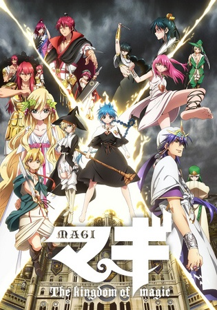

# Magi: The Kingdom of Magic

## Comentários pessoais
[Anotações baseadas na nossa conversa. O que você mais achou, o que odiou, momentos marcantes]

## Como a nota é calculada
* **A história é inteligente:** 
* **Personagens chamam a atenção:** 
* **O anime é bem feito:** 
* **Foge dos clichês:** 
* **O ritmo não enrola:** 
* **Quão o final é satisfatório:** 
* **Boas sacadas:** 
* **Fator WOW:** 

## Resumo
Após os eventos da primeira temporada, Alibaba retorna a Balbadd para confrontar seus demônios internos e reconstruir o reino, enquanto Aladdin viaja para o Reino de Magnostadt para aprender mais sobre a magia. Paralelamente, o conflito entre os magos e os exércitos de outros países se intensifica, revelando segredos sobre o mundo de Magi e os djinn.

## Informações Importantes
* **Djinn:** Seres poderosos que concedem poderes especiais aos seus mestres (metal vessels).
* **Magnostadt:** Reino focado puramente em estudos mágicos, com uma estrutura social baseada em níveis de magia.
* **Balbadd Arc:** Alibaba luta para mudar o sistema corrupto de seu país natal.
* **Guerra Mágica:** Conflito iminente entre nações que usam magia como arma principal.

## Links e Conexões
* **Animes similares:** [Magi: The Labyrinth of Magic](magi-the-labyrinth-of-magic.md) (prequela)
* **Mesmo Estúdio/Diretor:** Estúdio A-1 Pictures
* **Por que te lembra esse:** Expansão do mundo mágico introduzido na primeira temporada, com batalhas épicas e desenvolvimento político.
