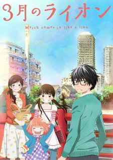

# 3-gatsu no Lion

## Comentários pessoais
[Anotações baseadas na nossa conversa. O que você mais achou, o que odiou, momentos marcantes]

## Como a nota é calculada
* **A história é inteligente:** 
* **Personagens chamam a atenção:** 
* **O anime é bem feito:** 
* **Foge dos clichês:** 
* **O ritmo não enrola:** 
* **Quão o final é satisfatório:** 
* **Boas sacadas:** 
* **Fator WOW:** 

## Resumo
Rei Kiriyama é um jogador profissional de Shogi de 17 anos que vive sozinho em Tóquio. Traumatizado por perdas familiares e pressionado pelo mundo competitivo, ele encontra refúgio nas irmãs Kawamoto, que o acolhem com calor e refeições caseiras. É uma jornada emocionante sobre amadurecimento e superação da solidão.

## Informações Importantes
* Shogi: Um jogo de tabuleiro japonês semelhante ao xadrez, central na vida e profissão de Rei.
* Solidão Profunda: O anime retrata de forma sensível a depressão e o isolamento de jovens gênios.
* Família Kawamoto: Akari, Hinata e Momo, as três irmãs que servem como o suporte emocional de Rei.
* Crescimento Pessoal: Diferente de muitos animes, o foco aqui é a evolução interna e a aceitação das vulnerabilidades.

## Links e Conexões
* Mesmo Estúdio: [Shaft](shaft.md)
* Mesmo Autor: [Chica Umino](chica-umino.md)

