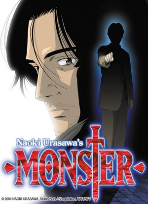

     1|     1|     1|---
     2|     2|     2|titulo: Monster
     3|     3|     3|titulo_original: モンスター (Monsutā)
     4|     4|     4|ano: "2004"
     5|     5|     5|genero:
     6|     6|     6|  - Thriller Psicológico
     7|     7|     7|  - Mistério
     8|     8|     8|  - Drama
     9|     9|     9|  - Suspense
    10|    10|    10|tags:
    11|    11|    11|  - serial-killer
    12|    12|    12|  - investigação
    13|    13|    13|  - psicopata
    14|    14|    14|  - europa
    15|    15|    15|  - adulto
    16|    16|    16|  - seinen
    17|    17|    17|status: Assistido parcialmente
    18|    18|    18|assistido: ago/2020
    19|    19|    19|nota final: ""
    20|    20|    20|link_referencia: https://myanimelist.net/anime/19/Monster
    21|    21|    21|veredito_rapido: ""
    22|    22|    22|---
    23|    23|    23|
    24|    24|    24|# Monster
    25|    25|    25|
    26|    26|    26|
    27|    27|    27|
    28|    28|    28|## Comentários pessoais
    29|    29|    29|[Anotações baseadas na nossa conversa. O que você mais achou, o que odiou, momentos marcantes]
    30|    30|    30|
    31|    31|    31|## Como a nota é calculada
    32|    32|    32|* **A história é inteligente:** 
    33|    33|    33|* **Personagens chamam a atenção:** 
    34|    34|    34|* **O anime é bem feito:** 
    35|    35|    35|* **Foge dos clichês:** 
    36|    36|    36|* **O ritmo não enrola:** 
    37|    37|    37|* **Quão o final é satisfatório:** 
    38|    38|    38|* **Boas sacadas:** 
    39|    39|    39|* **Fator WOW:** 
    40|    40|    40|
    41|    41|    41|## Resumo
    42|    42|    42|O Dr. Kenzo Tenma é um neurocirurgião japonês brilhante que trabalha em um hospital de prestígio na Alemanha Ocidental. Sua vida vira de cabeça para baixo quando ele toma uma decisão ética: operar um garotinho que chegou primeiro com um tiro na cabeça, em vez do prefeito da cidade. O prefeito morre, Tenma perde seu status, mas salva o garoto. Nove anos depois, Tenma descobre que o menino que ele salvou, Johan Liebert, cresceu para se tornar um serial killer frio, carismático e de inteligência aterrorizante. Sentindo-se responsável por ter "trazido um monstro de volta à vida", Tenma abandona sua carreira para caçar Johan através da Europa e corrigir seu erro.
    43|    43|    43|
    44|    44|    44|## Informações Importantes
    45|    45|    45|* **Johan Liebert:** Frequentemente citado como um dos maiores vilões da ficção. Ele não tem poderes sobrenaturais, mas usa sua genialidade, empatia sombria e carisma para manipular pessoas e levá-las a cometer atrocidades ou suicídio.
    46|    46|    46|* **Cenário Realista:** Ao contrário da maioria dos animes, *Monster* se passa em uma ambientação muito realista, explorando a Europa pós-Guerra Fria (principalmente Alemanha e República Tcheca), lidando com traumas de orfanatos clandestinos e o colapso do Bloco Oriental.
    47|    47|    47|* **O Valor da Vida:** A obra inteira é um debate filosófico pesado sobre a frase "todas as vidas têm o mesmo valor?", confrontando a ética médica do Dr. Tenma com o niilismo absoluto de Johan.
    48|    48|    48|* **Sem Poderes, Apenas Psicologia:** Não há mechas, magia ou cadernos da morte. Todo o suspense é construído através de jogos mentais, investigações policiais e exploração do lado mais sombrio da mente humana.
    49|    49|    49|
    50|    50|    50|## Links e Conexões
    51|    51|    51|* **Animes similares:** [[Death Note]], [[Psycho-Pass]]
    52|    52|    52|* **Mesmo Estúdio/Diretor:** Estúdio [[Madhouse]] / Diretor [[Masayuki Kojima]] (Baseado no mangá genial de [[Naoki Urasawa]])
    53|    53|    53|* **Por que te lembra esse:** Pela genialidade do antagonista e o intenso jogo de gato e rato, onde a investigação e o suspense psicológico ditam o ritmo da obra.