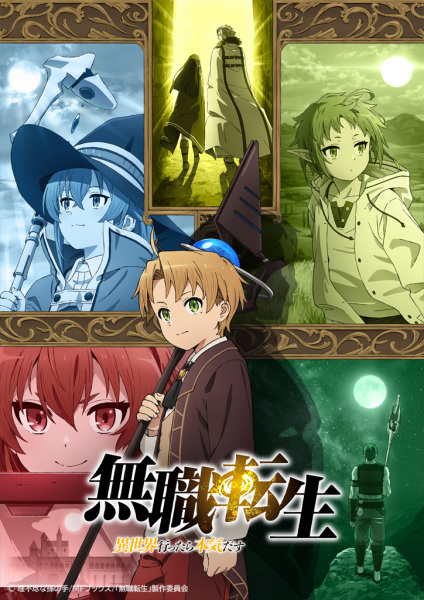

# Mushoku Tensei: Jobless Reincarnation

## Comentários pessoais
[Anotações]

## Como a nota é calculada
* **A história é inteligente:** 
* **Personagens chamam a atenção:** 
* **O anime é bem feito:** 
* **Foge dos clichês:** 
* **O ritmo não enrola:** 
* **Quão o final é satisfatório:** 
* **Boas sacadas:** 
* **Fator WOW:** 

## Resumo
Após uma vida marcada por bullying e desprezo, um homem de 34 anos tenta realizar algo heroico antes de morrer tragicamente. Em um giro do destino, ele desperta em outro mundo como Rudeus Greyrat, renascendo como um bebê. Mantendo suas memórias e conhecimentos da vida anterior, Rudeus rapidamente se adapta e exibe um talento mágico excepcional sob a orientação de Roxy Migurdia. Enquanto ele aprende esgrima com seu pai, Paul, e faz amizade com Sylphiette, Rudeus busca fazer valer sua segunda chance, superando seu passado traumático e, talvez, encontrando o amor que lhe faltou.

## Informações Importantes
* O anime é uma adaptação de uma série de light novels de Rifujin na Magonote, considerada um dos pilares do gênero Isekai moderno.
* A animação é produzida pelo Studio Bind, um estúdio criado especificamente para a produção desta obra.
* O sistema de magia é estruturado e detalhado, sendo um dos pontos centrais da evolução de Rudeus.
* A jornada de Rudeus não foca apenas na força, mas no crescimento pessoal e na superação dos traumas da sua vida como um *shut-in*.

## Links e Conexões
* **Animes similares:** [Re:Zero - Starting Life in Another World](rezero-starting-life-in-another-world.md), [That Time I Got Reincarnated as a Slime](that-time-i-got-reincarnated-as-a-slime.md)
* **Mesmo Estúdio/Diretor:** Estúdio [Studio Bind](studio-bind.md)
* **Por que te lembra esse:** Pelo foco profundo na jornada de auto-descoberta e evolução mágica em um mundo de fantasia detalhado.
