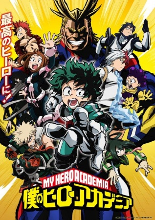

# My Hero Academia

## Comentários pessoais
[Anotações]

## Como a nota é calculada
* **A história é inteligente:** 
* **Personagens chamam a atenção:** 
* **O anime é bem feito:** 
* **Foge dos clichês:** 
* **O ritmo não enrola:** 
* **Quão o final é satisfatório:** 
* **Boas sacadas:** 
* **Fator WOW:** 

## Resumo
The appearance of "quirks," newly discovered super powers, has been steadily increasing over the years, with 80 percent of humanity possessing various abilities from manipulation of elements to shapeshifting. This leaves the remainder of the world completely powerless, and Izuku Midoriya is one such individual.

Since he was a child, the ambitious middle schooler has wanted nothing more than to be a hero. Izuku's unfair fate leaves him admiring heroes and taking notes on them whenever he can. But it seems that his persistence has borne some fruit: Izuku meets the number one hero and his personal idol, All Might. All Might's quirk is a unique ability that can be inherited, and he has chosen Izuku to be his successor!

Enduring many months of grueling training, Izuku enrolls in UA High, a prestigious high school famous for its excellent hero training program, and this year's freshmen look especially promising. With his bizarre but talented classmates and the looming threat of a villainous organization, Izuku will soon learn what it really means to be a hero.

[Written by MAL Rewrite]

## Informações Importantes
* **Individualidades:** Poderes únicos que se manifestam em 80% da população.
* **Heróis Profissionais:** Sistema de licenças e agências de heróis.
* **Temática:** Justiça, amizade e superação de limites.

## Links e Conexões
* **Animes similares:** [Naruto](naruto.md), [Black Clover](black-clover.md)
* **Mesmo Estúdio/Diretor:** Estúdio [Bones](bones.md)
* **Por que te lembra esse:** Protagonista determinado sem poderes iniciais que se torna forte.
* **Mesmo Estúdio/Diretor:** 
* **Por que te lembra esse:** [Breve explicação]
