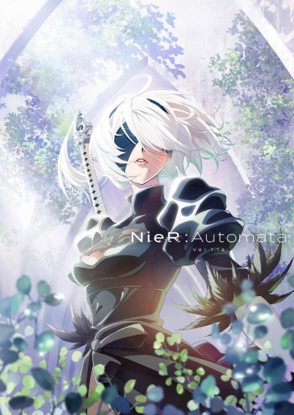

# NieR:Automata Ver1.1a

## Comentários pessoais
[Anotações]

## Como a nota é calculada
* **A história é inteligente:** 
* **Personagens chamam a atenção:** 
* **O anime é bem feito:** 
* **Foge dos clichês:** 
* **O ritmo não enrola:** 
* **Quão o final é satisfatório:** 
* **Boas sacadas:** 
* **Fator WOW:** 

## Resumo
Em um futuro distante, a Terra foi abandonada pelos humanos após invasões de alienígenas e seus misteriosos mecanismos de guerra. Para recuperar o planeta, a resistência humana envia androides de combate — conhecidos como "YoRHa" — para lutar contra as máquinas inimigas. A história acompanha o androide 2B, uma unidade de ataque equipada com uma espada gigante e uma viseira que oculta seus olhos, e seu companheiro de suporte, o androide de reconhecimento 9S. Enquanto lutam em um mundo pós-apocalíptico repleto de ruínas humanas e desertos infinitos, eles começam a questionar a natureza de seus inimigos, a verdade sobre a missão da resistência e o real motivo pelo qual os humanos abandonaram a Terra. A jornada os leva a descobrir segredos profundos sobre a existência, a memória e o que significa ter uma alma, culminando em uma reflexão existencial sobre a vida e a morte.

## Informações Importantes
* A obra é uma adaptação direta do jogo **NieR:Automata** (Square Enix, 2017), criado por Yoko Taro, famoso por narrativas não-lineares, finais múltiplos e temas filosóficos densos.
* O conceito de "Espelho" e "Protocolo de Auto-Destruição" são fundamentais: androides têm suas memórias armazenadas em um servidor central (The Bunker) e, ao morrerem, seus dados são recuperados em novos corpos, embora memórias emocionais muitas vezes se percam.
* A sociedade das máquinas evolui de forma autônoma, criando sua própria cultura, religião e até mesmo emoções, desafiando a visão dos androides de que são meros equipamentos sem alma.
* O "Vírus de Lógica" é uma ameaça crítica que afeta a sanidade dos androides, causando comportamentos erráticos e rebeliões, servindo como uma metáfora para a falibilidade da inteligência artificial.
* A estrutura da série respeita o jogo original, com múltiplas perspectivas (2B, 9S, A2) que revelam diferentes camadas da verdade, incluindo os eventos que levam ao "Final E" do jogo, adaptado magistralmente na Parte 2.

## Links e Conexões
* **Animes similares:** [Ergo Proxy](ergo-proxy.md), [Ghost in the Shell](ghost-in-the-shell-stand-alone-complex.md), [Plastic Memories](plastic-memories.md), [Axis Powers Hetalia](axis-powers-hetalia.md)
* **Mesmo Estúdio/Diretor:** Estúdio A-1 Pictures, direção de Ryouji Masuyama e supervisão de Yoko Taro
* **Por que te lembra esse:** Compartilham atmosfera pós-apocalíptica, protagonistas androides/cyborgs questionando sua existência, reflexões filosóficas profundas sobre o que define a humanidade e uma estética visual melancólica com trilha sonora marcante de Keiichi Okabe.
