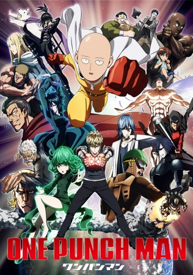

# One Punch Man

## Comentários pessoais
[Anotações]

## Como a nota é calculada
* **A história é inteligente:** 
* **Personagens chamam a atenção:** 
* **O anime é bem feito:** 
* **Foge dos clichês:** 
* **O ritmo não enrola:** 
* **Quão o final é satisfatório:** 
* **Boas sacadas:** 
* **Fator WOW:** 

## Resumo
Saitama é um herói aparentemente comum que possui um hobby bastante único: ser um herói. Para perseguir seu sonho de infância, Saitama treinou implacavelmente por três anos, perdendo todo o seu cabelo no processo. Agora, Saitama é tão poderoso que pode derrotar qualquer inimigo com apenas um soco. No entanto, não ter ninguém capaz de igualar sua força levou Saitama a um problema inesperado — ele não consegue mais sentir a emoção de lutar e tornou-se bastante entediado.

Um dia, Saitama chama a atenção de Genos, um ciborgue de 19 anos, que testemunha seu poder e deseja se tornar seu discípulo. Genos propõe que os dois se juntem à Associação de Heróis para se tornarem heróis certificados que sejam reconhecidos por suas contribuições positivas à sociedade. Saitama, chocado por ninguém saber quem ele é, rapidamente concorda. Encontrando novos aliados e enfrentando novos inimigos, Saitama embarca em uma nova jornada como membro da Associação de Heróis para experimentar a emoção da batalha que sentia antigamente.

## Informações Importantes
* **A Força Absurda de Saitama:** Após 3 anos de treinamento (100 flexões, 100 agachamentos, 100 abdominais, 10km de corrida diária), Saitama quebrou seu "limite" e tornou-se tão forte que derrota qualquer inimigo com um único soco, independente do poder do oponente.
* **Sistema de Classificação de Heróis:** A Associação de Heróis classifica os heróis em ranks (S, A, B, C), baseando-se em exames físicos e contribuições à sociedade. Saitama começa no rank C devido à sua aparência pouco impressionante.
* **Genos (Gêno):** Um ciborgue caçador de demônios que se torna discípulo de Saitama, buscando entender seu poder enquanto luta para proteger a humanidade contra ameaças crescentes.
* **Monstros e a Associação de Monstros:** Uma organização composta por seres que evoluíram além da biologia humana, liderada pelo misterioso "God" (Deus), que busca recrutar humanos evoluídos para destruir a sociedade.

## Links e Conexões
* **Animes similares:** [Mob Psycho 100](mob-psycho-100.md), [Gintama](gintama.md)
* **Mesmo Estúdio/Diretor:** Estúdio [Madhouse](madhouse.md) (Temporada 1) — conhecido por animes de ação exagerada
* **Por que te lembra esse:** Satiriza clichês de shonen com protagonista absurdamente poderoso que busca um desafio real.
