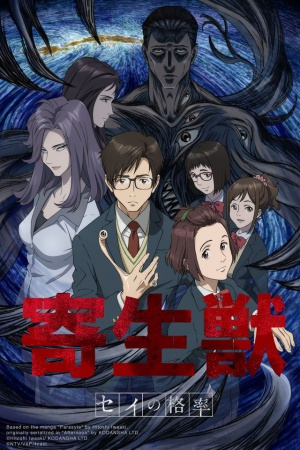

# Parasyte -the maxim-

## Comentários pessoais
[Anotações baseadas na nossa conversa. O que você mais achou, o que odiou, momentos marcantes]

## Como a nota é calculada
* **A história é inteligente:** 
* **Personagens chamam a atenção:** 
* **O anime é bem feito:** 
* **Foge dos clichês:** 
* **O ritmo não enrola:** 
* **Quão o final é satisfatório:** 
* **Boas sacadas:** 
* **Fator WOW:** 

## Resumo
Alienígenas parasitas chegam à Terra em silêncio. O objetivo deles é entrar no cérebro humano pelos ouvidos ou nariz, tomar o controle do corpo e devorar outros humanos. Shinichi Izumi, um adolescente comum, consegue impedir que um parasita atinja seu cérebro; em vez disso, o alienígena amadurece e toma controle de seu braço direito, adotando o nome de "Migi". Formando uma simbiose forçada, os dois precisam aprender a coexistir e lutar juntos para sobreviver contra os outros parasitas hostis que os veem como uma anomalia, tudo isso enquanto Shinichi lida com a lenta e inevitável mudança em sua própria humanidade.

## Informações Importantes
* **Os Parasitas:** Seres orgânicos com inteligência avançada e alta capacidade de aprendizado. Eles podem alterar livremente a biologia do corpo hospedeiro (transformando a cabeça e os membros em lâminas mortais).
* **Migi:** O parasita que habita o braço de Shinichi. Migi opera puramente por lógica fria e sobrevivência, não sentindo empatia, o que gera debates filosóficos fascinantes entre ele e o compassivo Shinichi.
* **Questionamento Ecológico e Filosófico:** O anime levanta grandes dúvidas: se a humanidade destrói o planeta, os parasitas não seriam apenas o "anticorpo" da Terra para controlar a praga humana? Quem é o verdadeiro "monstro"?
* **Evolução Psicológica:** A série brilha ao mostrar como a convivência com Migi afeta a personalidade e os sentimentos de Shinichi de forma drástica e realista.

## Links e Conexões
* **Animes similares:** [Psycho-Pass](psycho-pass.md), [Monster](monster.md)
* **Mesmo Estúdio/Diretor:** Estúdio [Madhouse](madhouse.md)
* **Por que te lembra esse:** Pela reflexão existencial intensa sobre o que nos torna "humanos" e o embate moral de perspectivas diferentes.