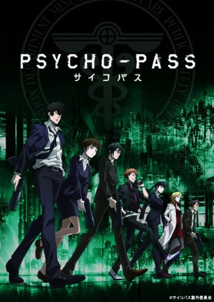

# Psycho-Pass

## Comentários pessoais
[Anotações baseadas na nossa conversa. O que você mais achou, o que odiou, momentos marcantes]

## Como a nota é calculada
* **A história é inteligente:** 
* **Personagens chamam a atenção:** 
* **O anime é bem feito:** 
* **Foge dos clichês:** 
* **O ritmo não enrola:** 
* **Quão o final é satisfatório:** 
* **Boas sacadas:** 
* **Fator WOW:** 

## Resumo
No século 22, o Japão é governado pelo Sistema Sibyl, uma rede de inteligência artificial que quantifica ativamente o estado mental e a probabilidade de uma pessoa cometer crimes, medida conhecida como "Psycho-Pass". A história segue Akane Tsunemori, uma inspetora novata na Divisão de Investigação Criminal, que trabalha ao lado dos "Executores" — criminosos latentes encarregados de caçar outros criminosos. Logo, ela descobre que o sistema que dita o que é a justiça pode ser muito mais falho e corrupto do que a sociedade acredita.

## Informações Importantes
* **O Sistema Sibyl:** O cérebro tecnológico que governa a sociedade, escaneando mentes constantemente e determinando os empregos, a justiça e o destino de cada cidadão.
* **Psycho-Pass e Coeficiente Criminal:** O número que reflete o estresse e a propensão ao crime de uma pessoa. Se o número passar de um limite, a pessoa é presa ou executada preventivamente.
* **Dominator:** A arma padrão dos inspetores e executores. Ela só dispara se o Sistema Sibyl julgar que o alvo é uma ameaça, mudando de modo "paralisador" para "letal" dependendo do Coeficiente Criminal do alvo.
* **Inspetores e Executores:** Os Executores são cães de caça descartáveis, enquanto os Inspetores são a elite de ficha limpa que os comanda.

## Links e Conexões
* **Animes similares:** [Death Note](death-note.md), [Code Geass](code-geass.md)
* **Mesmo Estúdio/Diretor:** Estúdio [Production I.G](production-i.g.md)
* **Por que te lembra esse:** Discussões complexas sobre o que é certo e errado perante a lei e um sistema governamental absoluto.