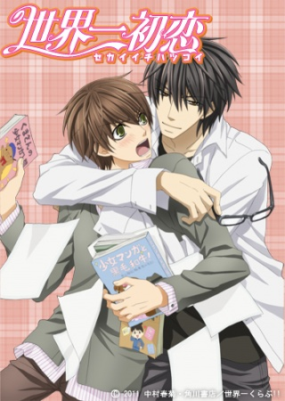

# Sekaiichi Hatsukoi

## Comentários pessoais
[Anotações]

## Como a nota é calculada
* **A história é inteligente:** 
* **Personagens chamam a atenção:** 
* **O anime é bem feito:** 
* **Foge dos clichês:** 
* **O ritmo não enrola:** 
* **Quão o final é satisfatório:** 
* **Boas sacadas:** 
* **Fator WOW:** 

## Resumo
Onodera Ritsu abandona o trabalho em uma editora de literatura clássica para seguir seu próprio caminho, aceitando uma posição na Marvelous Editorial, uma empresa especializada em mangás do gênero Shoujo. Para sua surpresa, ele é designado para a equipe de edição de mangás de romance, um gênero que ele despreza profundamente. Além disso, seu novo chefe e editor responsável é Takano Masamune, um homem frio e exigente que, para a consternação de Ritsu, revela ser seu ex-colega de classe do ensino médio, Saga Kyouichi — o único garoto que Ritsu já amou e que lhe deu o fora no passado. Enquanto Ritsu tenta manter seu profissionalismo e esconder seu passado, Takano faz de tudo para reconquistá-lo, provando que seus sentimentos não mudaram. A história acompanha não apenas o casal principal, mas também outros trios amorosos dentro do ambiente de trabalho da editora, explorando as complexidades de relacionamentos homossexuais no ambiente corporativo.

## Informações Importantes
* A obra é uma das pioneiras no gênero BL (Boys' Love) em formato de série de TV, focada no ambiente de trabalho editorial de mangás, trazendo uma visão realista (embora dramática) de como funciona uma editora de mangás.
* O relacionamento entre Ritsu e Takano é o fio condutor, mas a série é estruturada em arcos que também focam em outros casais: Hatori Yoshiyuki e Yoshino Chiaki (o famoso casal de "Nakama" na indústria), e Kisa Shouta com Yukina Kou.
* A série possui conexão direta com "Junjou Romantica" (mesmo autor, Shungiku Nakamura), compartilhando o mesmo universo fictício e menções cruzadas, embora as histórias sejam independentes.
* O tema central é o amadurecimento emocional e a superação de traumas do passado; Ritsu luta contra sua própria autoimagem e o medo de ser visto apenas como "posição" de Takano, enquanto tenta provar seu valor como editor.
* A obra aborda as pressões do mercado editorial japonês, incluindo prazos apertados, exigências de vendas e a competição interna entre departamentos (literatura vs. mangá).

## Links e Conexões
* **Animes similares:** [Junjou Romantica](junjou-romantica.md), [Yuri on Ice](yuri-on-ice.md), [Given](given.md), [Doukyuusei](doukyuusei.md)
* **Mesmo Estúdio/Diretor:** Estúdio Studio Deen, direção de Kōnosuke Uda
* **Por que te lembra esse:** Compartilham o foco em relacionamentos homoafetivos com desenvolvimento emocional profundo, ambientação no mundo real (editorial/esportivo/escolar) e uma estética dramática que equilibra romance e crescimento pessoal.
