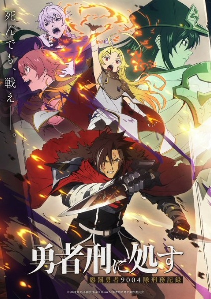

# Sentenced to Be a Hero

## Comentários pessoais
[Anotações]

## Como a nota é calculada
* **A história é inteligente:** 
* **Personagens chamam a atenção:** 
* **O anime é bem feito:** 
* **Foge dos clichês:** 
* **O ritmo não enrola:** 
* **Quão o final é satisfatório:** 
* **Boas sacadas:** 
* **Fator WOW:** 

## Resumo
Em um mundo onde o título de Herói é uma punição, criminosos perigosos são condenados às linhas de frente de uma guerra sem fim contra Lordes Demônios. Sem a misericórdia da morte, eles são revividos e enviados de volta à batalha eternamente. Xylo Forbartz, um ex-comandante dos Cavaleiros Sagrados, agora lidera a Unidade Penal de Heróis 9004. Durante uma missão, ele encontra Teoritta, uma "Deusa" que atua como arma viva, mudando o equilíbrio da guerra e seu próprio destino enquanto ele tenta descobrir a verdade sobre sua condenação.

## Informações Importantes
* A premissa subverte o tropo clássico do "Herói" ao transformá-lo em uma condenação militar perpétua.
* Produzido pelo estúdio Studio KAI.
* Foca na sobrevivência de um esquadrão considerado descartável pela nação que servem.
* A dinâmica entre Xylo e a entidade Teoritta é o ponto central que move a trama política e bélica.

## Links e Conexões
* **Animes similares:** [86: Eighty-Six](86.md) (pelo foco em esquadrões descartáveis), [Re:Zero](rezero-starting-life-in-another-world.md) (pela punição de retornos contínuos)
* **Mesmo Estúdio/Diretor:** Estúdio [Studio KAI](studio-kai.md)
* **Por que te lembra esse:** Pela ambientação de guerra sombria e o fardo de ser uma peça descartável em um conflito maior.
