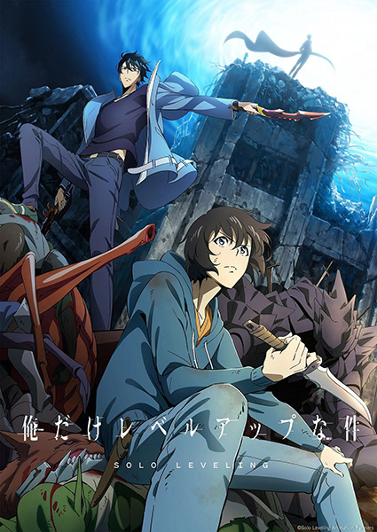

# Solo Leveling

## Comentários pessoais
[Anotações]

## Como a nota é calculada
* **A história é inteligente:** 
* **Personagens chamam a atenção:** 
* **O anime é bem feito:** 
* **Foge dos clichês:** 
* **O ritmo não enrola:** 
* **Quão o final é satisfatório:** 
* **Boas sacadas:** 
* **Fator WOW:** 

## Resumo
Humanity was caught at a precipice a decade ago when the first gates—portals linked with other dimensions that harbor monsters immune to conventional weaponry—emerged around the world. Alongside the appearance of the gates, various humans were transformed into hunters and bestowed superhuman abilities. Responsible for entering the gates and clearing the dungeons within, many hunters chose to form guilds to secure their livelihoods.

## Informações Importantes
* Principais temas e elementos do mundo explorados na obra.

## Links e Conexões
* **Animes similares:** [[ ]] 
* **Mesmo Estúdio/Diretor:** 
* **Por que te lembra esse:** [Breve explicação]
