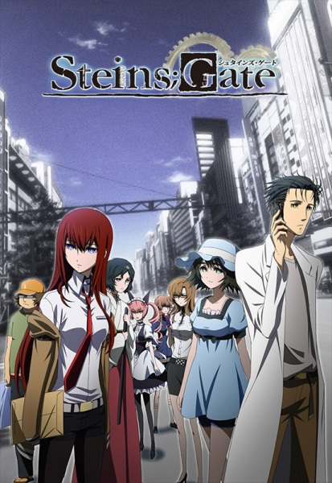

# Steins;Gate

## Comentários pessoais
[Anotações baseadas na nossa conversa. O que você mais achou, o que odiou, momentos marcantes]

## Como a nota é calculada
* **A história é inteligente:** 
* **Personagens chamam a atenção:** 
* **O anime é bem feito:** 
* **Foge dos clichês:** 
* **O ritmo não enrola:** 
* **Quão o final é satisfatório:** 
* **Boas sacadas:** 
* **Fator WOW:** 

## Resumo
Rintarou Okabe é um universitário excêntrico que se autodenomina um "cientista louco". Ele e seus amigos passam os dias em um laboratório improvisado inventando "gadgets do futuro". Por acidente, eles descobrem que uma de suas invenções — um micro-ondas modificado — é capaz de enviar mensagens de texto para o passado. O que começa como uma brincadeira inocente de alterar pequenos detalhes do cotidiano rapidamente se transforma em um pesadelo: a organização secreta SERN está atrás da mesma tecnologia, e alterar o tempo gera consequências devastadoras, forçando Okabe a correr contra o tempo em um ciclo de desespero para salvar a vida das pessoas que ama.

## Informações Importantes
* **D-Mails (DeLorean Mails):** Mensagens de texto enviadas para o passado que podem alterar o fluxo da história (as "Linhas de Mundo").
* **Linhas de Mundo (World Lines):** Universos paralelos. Cada vez que o passado é alterado, o universo muda de rota (da linha Alpha para a linha Beta, etc). Ninguém se lembra da linha anterior, exceto...
* **Reading Steiner:** A habilidade única de Okabe. Quando a Linha de Mundo muda, as memórias de todos são reescritas para se adequarem ao novo passado, mas Okabe retém a memória do mundo anterior. Ele é o único que sabe as consequências do que foi alterado.
* **SERN:** Organização global de pesquisa (inspirada na CERN da vida real) que atua como a principal ameaça antagônica, buscando o monopólio da viagem no tempo para instaurar uma distopia.

## Links e Conexões
* **Animes similares:** [Death Note](death-note.md) (pela genialidade do roteiro e reviravoltas)
* **Mesmo Estúdio/Diretor:** Estúdio [White Fox](white-fox.md) / Diretor [Hiroshi Hamasaki](hiroshi-hamasaki.md)
* **Por que te lembra esse:** A trama é um quebra-cabeça narrativo meticulosamente amarrado. As reviravoltas na segunda metade do anime são de um impacto similar ou superior aos grandes confrontos de Kira e L.