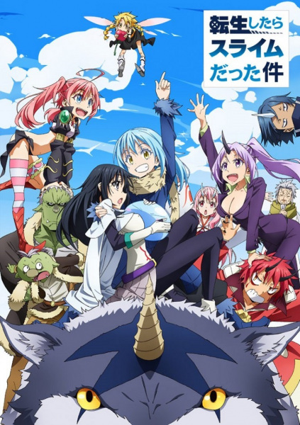

# That Time I Got Reincarnated as a Slime

## Comentários pessoais
[Anotações]

## Como a nota é calculada
* **A história é inteligente:** 
* **Personagens chamam a atenção:** 
* **O anime é bem feito:** 
* **Foge dos clichês:** 
* **O ritmo não enrola:** 
* **Quão o final é satisfatório:** 
* **Boas sacadas:** 
* **Fator WOW:** 

## Resumo
Satoru Mikami, um funcionário corporativo de 37 anos, morre após um ataque inesperado e reencarna como um slime em um mundo de fantasia desconhecido. Com novas habilidades, incluindo a capacidade de devorar qualquer coisa e mimetizar suas características, ele faz amizade com o poderoso dragão Veldora, que o nomeia Rimuru Tempest. A partir daí, Rimuru embarca em uma jornada para construir uma nação onde diversas raças possam coexistir pacificamente.

## Informações Importantes
* O anime é uma adaptação de uma série de light novels de grande sucesso escrita por Fuse.
* Rimuru Tempest se tornou um dos protagonistas mais icônicos do gênero Isekai por sua natureza benevolente e capacidade de diplomacia.
* A animação é produzida pelo estúdio 8bit.
* O enredo destaca-se pela construção de mundo e pela progressão da vila de Rimuru em um império próspero e multirracial.

## Links e Conexões
* **Animes similares:** [Mushoku Tensei: Jobless Reincarnation](mushoku-tensei-jobless-reincarnation.md), [Overlord](overlord.md), [Tsukimichi: Moonlit Fantasy](tsukimichi-moonlit-fantasy.md)
* **Mesmo Estúdio/Diretor:** Estúdio [8bit](8bit.md)
* **Por que te lembra esse:** Pela progressão do protagonista em um mundo de fantasia, foco em construção de comunidades e uma abordagem carismática ao gênero Isekai.
