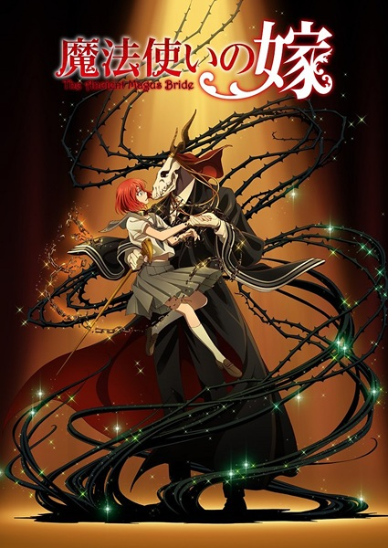

# The Ancient Magus' Bride

## Comentários pessoais
[Anotações]

## Como a nota é calculada
* **A história é inteligente:** 
* **Personagens chamam a atenção:** 
* **O anime é bem feito:** 
* **Foge dos clichês:** 
* **O ritmo não enrola:** 
* **Quão o final é satisfatório:** 
* **Boas sacadas:** 
* **Fator WOW:** 

## Resumo
Chise Hatori é uma jovem japonesa com a rara habilidade de ver seres mágicos (conhecidos como "fadas" ou "espíritos"), o que a torna uma "Mago" — um ser humano capaz de absorver o mana do mundo. Marginalizada e sem esperanças, ela se vende em um leilão sombrio para um misterioso esqueleto chamado Elias Ainsworth, que revela ser um Mago Ashland (um ser híbrido entre humano e fada). Elias a compra como sua "noiva" e aprendiz, prometendo ensinar-lhe sobre o mundo da magia ocidental. Ao se mudar para um vilarejo rural na Inglaterra, Chise começa a descobrir que a magia não é apenas feitiços, mas uma conexão profunda com a natureza e com criaturas antigas. Enquanto explora esse novo mundo repleto de dragões, fadas e magos excêntricos, ela lentamente cura suas feridas emocionais e encontra um propósito, enquanto Elias tenta entender os complexos sentimentos humanos que começam a despertar nele.

## Informações Importantes
* O universo da obra mistura o folclore celta, mitologia grega e o sistema de magia ocidental com a flora e fauna mágica da Grã-Bretanha.
* A diferença entre "Magos" e "Feiticeiros" é fundamental: Magos são humanos com afinidade natural para magia e absorção de mana, enquanto Feiticeiros são seres que estudam a arte magicamente, muitas vezes sem a mesma conexão natural.
* A "Torre de Londres" atua como a organização reguladora da magia no Reino Unido, mantendo o equilíbrio entre o mundo humano e o mundo mágico, mediado por pessoas como o Dr. Frankenstein (um dos diretores).
* O "Símbolo de Dragão" é um marco geográfico e mágico crucial: Chise carrega uma maldição que a conecta a um dragão adormecido, o que a torna um alvo para magos das trevas que desejam usar seu poder.
* A relação entre Elias e Chise desafia as normas tradicionais: ele é um ser não-humano tentando compreender a humanidade através dela, enquanto ela aprende a valorizar sua própria vida em um ambiente onde sua "maldição" é vista como um dom.

## Links e Conexões
* **Animes similares:** [Witch Hat Atelier](witch-hat-atelier.md), [Flying Witch](flying-witch.md), [Little Witch Academia](little-witch-academia.md), [Pandora Hearts](pandora-hearts.md)
* **Mesmo Estúdio/Diretor:** Estúdio Wit Studio (Temporada 1), direção de Norihiro Naganuma
* **Por que te lembra esse:** Compartilham temáticas de magia ocidental, mundo ricamente construído com mitologia e folclore, protagonistas que aprendem sobre magia em um ambiente acolhedor mas perigoso, e foco na relação mestre-aprendiz.
