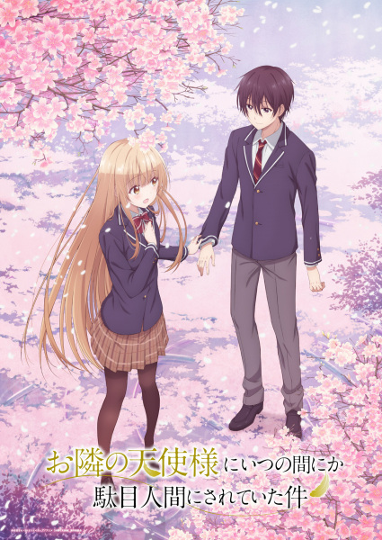

# The Angel Next Door Spoils Me Rotten

## Comentários pessoais
É um bom anime para o estilo. É leve, fofo, muito sensível e traz uma gostosa visão de um amor adolescente improvável, mas muito carinhoso. Como a maioria dos animes, não foca na sexualidade, mas não retira ela do contexto. Contudo mantém o que parece ser um caminho saudável de um bom relacionamento adolescente, algo quase inimaginável hoje.

## Como a nota é calculada
* **A história é inteligente:** 7
* **Personagens chamam a atenção:** 9
* **O anime é bem feito:** 10
* **Foge dos clichês:** 8
* **O ritmo não enrola:** 8
* **Quão o final é satisfatório:** 10
* **Boas sacadas:** 8
* **Fator WOW:** 7

## Resumo
Mahiru Shiina é conhecida como o "Anjo" da escola: uma beleza divina amada por todos que se destaca academicamente e atleticamente. Ela vive em um mundo completamente diferente de Amane Fujimiya, seu vizinho de porta, com quem nunca trocou uma palavra. O silêncio é quebrado quando Fujimiya empresta seu guarda-chuva para Shiina em um dia chuvoso. A partir desse gesto de bondade, Shiina, preocupada com a falta de cuidado de Fujimiya com sua saúde e seu apartamento, começa a cozinhar e limpar para ele. À medida que a dupla passa mais tempo junta, eles exploram a verdadeira natureza do relacionamento deles e os sentimentos gentis que emergem.

## Informações Importantes
* O título original, "Otonari no Tenshi-sama", reflete como Shiina é vista pelos outros, mas a dinâmica muda quando apenas Amane descobre sua verdadeira personalidade.
* A dinâmica do anime é focada no desenvolvimento gradual do afeto entre os dois vizinhos de porta.
* A série é baseada na série de light novels de mesmo nome escrita por Saekisan.
* O estúdio responsável pela animação é o Project No.9.

## Links e Conexões
* **Animes similares:** [Horimiya](horimiya.md), [Kaguya-sama: Love is War](kaguya-sama-love-is-war.md), [My Dress-Up Darling](my-dress-up-darling.md)
* **Mesmo Estúdio/Diretor:** Estúdio [Project No.9](project-no-9.md)
* **Por que te lembra esse:** Pelo desenvolvimento gradual e carinhoso do romance entre vizinhos com personalidades opostas, focando no conforto e amadurecimento emocional.
