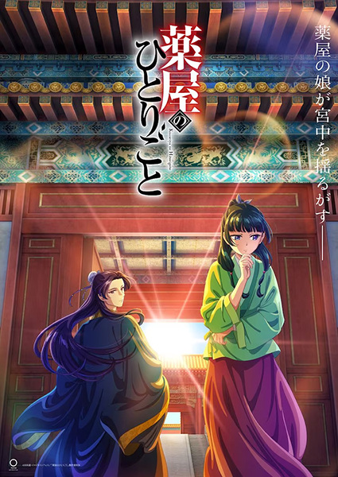

     1|     1|     1|     1|---
     2|     2|     2|     2|titulo: "Kusuriya no Hitorigoto"
     3|     3|     3|     3|titulo_original: "薬屋のひとりごと"
     4|     4|     4|     4|ano: "2023"
     5|     5|     5|     5|genero:
     6|     6|     6|     6|  - Drama
     7|     7|     7|     7|  - Mystery
     8|     8|     8|     8|tags: []
     9|     9|     9|     9|status: "Assistido"
    10|    10|    10|    10|assistido: ""
    11|    11|    11|    11|nota final: ""
    12|    12|    12|    12|link_referencia: "https://myanimelist.net/anime/54492/Kusuriya_no_Hitorigoto"
    13|    13|    13|    13|veredito_rapido: ""
    14|    14|    14|    14|---
    15|    15|    15|    15|
    16|    16|    16|    16|# The Apothecary Diaries
    17|    17|    17|    17|
    18|    18|    18|    18|
    19|    19|    19|    19|
    20|    20|    20|    20|## Comentários pessoais
    21|    21|    21|    21|[Anotações]
    22|    22|    22|    22|
    23|    23|    23|    23|## Como a nota é calculada
    24|    24|    24|    24|* **A história é inteligente:** 
    25|    25|    25|    25|* **Personagens chamam a atenção:** 
    26|    26|    26|    26|* **O anime é bem feito:** 
    27|    27|    27|    27|* **Foge dos clichês:** 
    28|    28|    28|    28|* **O ritmo não enrola:** 
    29|    29|    29|    29|* **Quão o final é satisfatório:** 
    30|    30|    30|    30|* **Boas sacadas:** 
    31|    31|    31|    31|* **Fator WOW:** 
    32|    32|    32|    32|
    33|    33|    33|    33|## Resumo
    34|    34|    34|    34|Maomao, an apothecary's daughter, has been plucked from her peaceful life and sold to the lowest echelons of the imperial court. Now merely a maid, Maomao settles into her new mundane life and hides her extensive knowledge of medicine in order to avoid any unwanted attention.
    35|    35|    35|    35|
    36|    36|    36|    36|Not long after Maomao's arrival, the emperor's infant children inexplicably begin to experience grave symptoms—almost as if a curse has been cast. The curious Maomao easily solves the mystery and, to remain out of the limelight, attempts to leave an anonymous tip. Unfortunately, the dashing and perceptive eunuch Jinshi sees through it and manages to single her out.
    37|    37|    37|    37|
    38|    38|    38|    38|In recognition of her talent, Maomao is promoted to lady-in-waiting for the emperor's favorite concubine, Gyokuyou. As Maomao continues to remedy the numerous ailments afflicting the imperial court, her pharmaceutical expertise quickly proves indispensable.
    39|    39|    39|    39|
    40|    40|    40|    40|[Written by MAL Rewrite]
    41|    41|    41|    41|
    42|    42|    42|    42|
    43|    43|    43|    43|
    44|    44|    44|    44|## Informações Importantes
    45|    45|    45|    45|* **Medicina Tradicional:** Foco em ervas medicinais e diagnósticos.
    46|    46|    46|    46|* **Intriga Política:** Intrigas na corte imperial chinesa.
    47|    47|    47|    47|* **Temática:** Inteligência, observação e justiça.
    48|    48|    48|    48|
    49|    49|    49|    49|
    50|    50|    50|    50|
    51|    51|    51|    51|## Links e Conexões
* **Animes similares:** [Frieren: Beyond Journey's End](frieren-beyond-journeys-end.md), [Hyouka](https://myanimelist.net/anime/12077/Hyouka)
* **Mesmo Estúdio/Diretor:** Estúdio [OLM](https://myanimelist.net/anime/producer/4/OLM)
* **Por que te lembra esse:** Protagonista inteligente que resolve problemas com sabedoria e raciocínio lógico.
