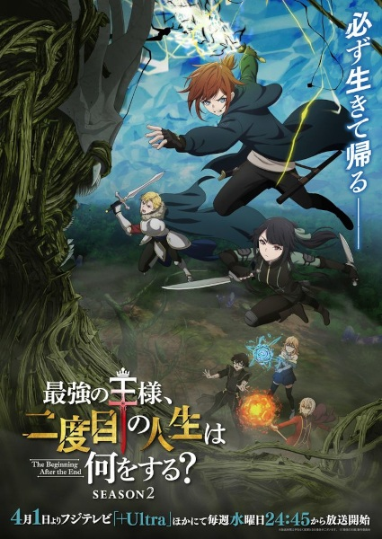

# The Beginning After the End

## Comentários pessoais
[Anotações]

## Como a nota é calculada
* **A história é inteligente:** 
* **Personagens chamam a atenção:** 
* **O anime é bem feito:** 
* **Foge dos clichês:** 
* **O ritmo não enrola:** 
* **Quão o final é satisfatório:** 
* **Boas sacadas:** 
* **Fator WOW:** 

## Resumo
A história acompanha a reencarnação de um rei poderoso em um novo mundo vibrante, cheio de magia e criaturas perigosas. Determinado a não desperdiçar sua segunda chance, ele busca forjar um novo destino, enfrentando desafios que testarão não apenas sua força, mas sua sabedoria acumulada em sua vida anterior.

## Informações Importantes
* Baseado na popular série de novel e webcomic de mesmo nome.
* O anime é uma produção que explora profundamente o gênero Isekai, focando na progressão de poder e política do novo mundo.
* O protagonista mantém a astúcia e a mentalidade de um governante experiente, o que diferencia suas interações das de outros protagonistas do gênero.
* A animação e a produção buscam dar vida aos cenários fantásticos descritos na obra original.

## Links e Conexões
* **Animes similares:** [Mushoku Tensei: Jobless Reincarnation](mushoku-tensei-jobless-reincarnation.md), [Re:Zero - Starting Life in Another World](rezero-starting-life-in-another-world.md)
* **Mesmo Estúdio/Diretor:** Estúdio [Studio A-CAT](studio-a-cat.md)
* **Por que te lembra esse:** Pela premissa de reencarnação de um indivíduo experiente buscando uma vida melhor e mais plena em um mundo de fantasia.
