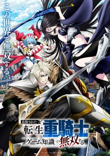

# The Exiled Heavy Knight Knows How to Game the System

## Comentários pessoais
Anime assistido via Crunchyroll. A animação do estúdio GoHands é visualmente distinta, com giro de câmera 360° e movimentos rápidos, criando uma estética única. No entanto, o ritmo narrativo é extremamente lento: lutas simples se arrastam por dois episódios, e a história avança com pouca profundidade. A premissa — um cavaleiro pesado exilado que usa conhecimento de jogo para dominar — é interessante, mas a execução não traz novidades ou complexidade. Dá para assistir em 3x para economizar tempo sem perder conteúdo relevante.

## Como a nota é calculada
* **A história é inteligente:** 2
* **Personagens chamam a atenção:** 3
* **O anime é bem feito:** 3
* **Foge dos clichês:** 2
* **O ritmo não enrola:** 1
* **Quão o final é satisfatório:** 2
* **Boas sacadas:** 3
* **Fator WOW:** 4

## Resumo
Elymas é descendente de uma linhagem de mestres espadachins e passa pelo Ritual da Bênção Divina aos 15 anos. Esperava receber a classe de Mestre Espadachim, mas acaba com a classe considerada defeituosa: Cavaleiro Pesado. Como resultado, perde o status de futuro chefe do lar e é exilado. Os Cavaleiros Pesados são estigmatizados como classe de covardes e preguiçosos. No entanto, Elymas conhece a verdade: o mundo em que vive é idêntico ao jogo que ele jogava em sua vida anterior. A classe Cavaleiro Pesado, aparentemente inútil, é na verdade a mais poderosa do jogo. Com esse conhecimento, Elymas busca conquistar o mundo usando suas habilidades e estatísticas desequilibradas.

## Informações Importantes
* **Título oficial (MAL):** Tsuihou sareta Tensei Juukishi wa Game Chishiki de Musou suru.
* **Título em inglês:** The Exiled Heavy Knight Knows How to Game the System.
* **Fonte:** Web manga publicada pela Kadokawa (via Kodansha USA).
* **Estúdio:** GoHands (responsável por obras como "Hand Shakers" e "K Project").
* **Temporada:** Verão 2026.
* **Episódios:** 26 (estimados, 23 min cada; em exibição até o momento da entrada).
* **Classificação:** R — 17+ (violência e profanidade).
* **Gênero principal:** Ação, Aventura, Fantasia, Isekai, Reencarnação.
* **Status de transmissão:** Em exibição; disponível no Crunchyroll.
* **Produção:** Shochiku, Mainichi Broadcasting System, Kodansha, Glovision, Crunchyroll, Shochiku Music Publishing, Muse Communication.
* **Licenciadores:** Nenhum listado no momento (aguardando licenciamento internacional).
* **Sistema do mundo:** Mundo baseado em um sistema de RPG com classes divinamente atribuídas (Guerreiro, Cavaleiro Pesado, Mago, etc.). O protagonista usa conhecimento de jogo para explorar as fraquezas e vantagens ocultas de sua classe.
* **Ponto-chave:** A premissa de "classe rejeitada que é a mais poderosa" segue uma fórmula conhecida, mas a execução visual e narrativa não traz diferenciais significativos.
* **Observação técnica:** Estilo visual com giro de câmera 360° e movimentos rápidos é a marca registrada do estúdio, mas não compensa o ritmo lento da narrativa.

## Links e Conexões
* **Animes similares:** [Mushoku Tensei: Jobless Reincarnation](mushoku-tensei-jobless-reincarnation.md) (reencarnação com conhecimento anterior), [That Time I Got Reincarnated as a Slime](that-time-i-got-reincarnated-as-a-slime.md) (isekai com progressão de poder), [Solo Leveling](solo-leveling.md) (sistema de progressão de poder)
* **Mesmo Estúdio/Diretor:** Estúdio [GoHands](https://myanimelist.net/anime/producer/132/GoHands) — conhecido por animações visualmente distintas e movimentos rápidos de câmera.
* **Por que te lembra esse:** A fórmula do protagonista exilado que usa conhecimento prévio para dominar um sistema de RPG lembra diretamente Mushoku Tensei e Solo Leveling; a estética visual lembra as produções anteriores do GoHands.
