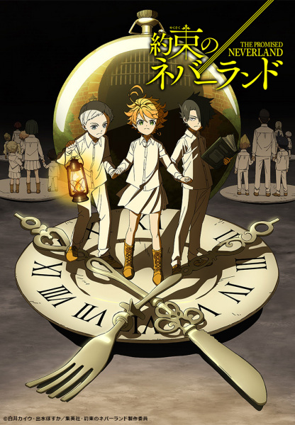

# The Promised Neverland

## Comentários pessoais
[Anotações baseadas na nossa conversa. O que você mais achou, o que odiou, momentos marcantes]

## Como a nota é calculada
* **A história é inteligente:** 
* **Personagens chamam a atenção:** 
* **O anime é bem feito:** 
* **Foge dos clichês:** 
* **O ritmo não enrola:** 
* **Quão o final é satisfatório:** 
* **Boas sacadas:** 
* **Fator WOW:** 

## Resumo
Emma, Norman e Ray são as crianças mais brilhantes do orfanato Grace Field House. Eles vivem uma vida pacífica e feliz sob os cuidados carinhosos da mulher que chamam de "Mãe", Isabella. No entanto, ao quebrarem a única regra do lugar — nunca ultrapassar os portões —, eles descobrem uma verdade aterrorizante: o orfanato é, na verdade, uma fazenda que cultiva crianças como alimento (especialmente seus cérebros) para uma raça de demônios, e a amada "Mãe" é a carcereira. Agora, os três prodígios precisam usar toda a sua genialidade para criar um plano de fuga impossível para todas as crianças antes que sejam "colhidos".

## Informações Importantes
* **Grace Field House:** Um orfanato de elite que funciona como uma fazenda premium. As crianças lá criadas recebem a melhor educação possível, pois os demônios consideram cérebros desenvolvidos uma iguaria de luxo.
* **A "Mãe" (Isabella):** A cuidadora das crianças. Ela é uma adversária formidável, incrivelmente inteligente, observadora e fisicamente impecável. O embate mental entre ela e as crianças é o coração da obra.
* **Demônios:** Criaturas monstruosas que dominam o mundo exterior e exigem o sacrifício de humanos para se alimentarem.
* **Rastreadores:** Todas as crianças possuem um microchip implantado na orelha, permitindo que a Mãe saiba sempre onde estão, o que torna o planejamento da fuga um quebra-cabeça logístico absurdo.

## Links e Conexões
* **Animes similares:** [Death Note](death-note.md), [Code Geass](code-geass.md)
* **Mesmo Estúdio/Diretor:** Estúdio [CloverWorks](cloverworks.md) / Diretor [Mamoru Kanbe](mamoru-kanbe.md)
* **Por que te lembra esse:** O constante jogo de "gato e rato", o blefe, a guerra de informações e a necessidade de elaborar estratégias geniais contra um inimigo em posição de poder absoluto.