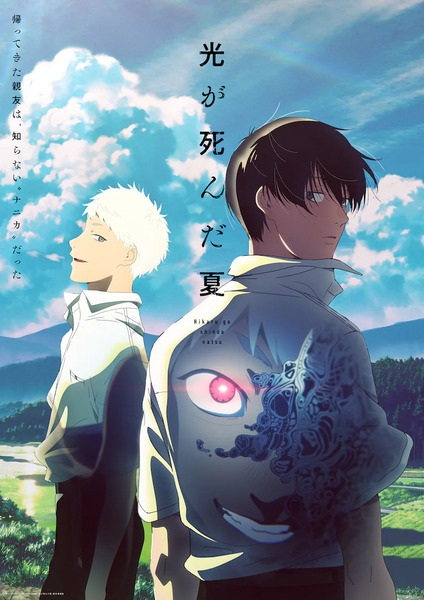

# The Summer Hikaru Died

## Comentários pessoais
[Anotações baseadas na nossa conversa. O que você mais achou, o que odiou, momentos marcantes]

## Como a nota é calculada
* **A história é inteligente:** 
* **Personagens chamam a atenção:** 
* **O anime é bem feito:** 
* **Foge dos clichês:** 
* **O ritmo não enrola:** 
* **Quão o final é satisfatório:** 
* **Boas sacadas:** 
* **Fator WOW:** 

## Resumo
Yoshiki e Hikaru são dois amigos que cresceram juntos em uma pequena vila nas montanhas. Após um incidente nas montanhas, Hikaru morre, mas algo assume seu corpo e retorna para Yoshiki. Embora pareça o Hikaru de sempre, Yoshiki percebe que essa entidade não é mais seu amigo humano, mas algo não-humano que assumiu sua forma. Uma história de horror psicológico sobre luto, identidade e a tensão entre o amor e o medo do desconhecido.

## Informações Importantes
* **Entidade Não-Humana:** Algo sem nome que assume a forma física de Hikaru após sua morte real.
* **Vila nas Montanhas:** Ambiente claustrofóbico onde todos conhecem todos, aumentando o terror psicológico.
* **Luto e Aceitação:** Yoshiki luta para aceitar que seu amigo real se foi, enquanto desenvolve sentimentos pela entidade.
* **Horror Corporal:** A entidade ocasionalmente perde o controle, revelando sua verdadeira natureza monstruosa.

## Links e Conexões
* **Animes similares:** [Mushishi](mushishi.md) (atmosfera sobrenatural), [Paranoia Agent](paranoia-agent.md) (horror psicológico)
* **Mesmo Estúdio/Diretor:** Estúdio Cygames Pictures
* **Por que te lembra esse:** Subverte o tropo de "amigo que volta diferente" com uma abordagem sensível e aterrorante sobre identidade.
