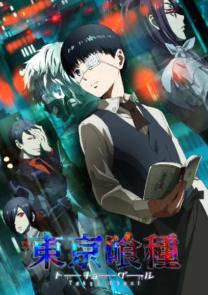

# Tokyo Ghoul

## Comentários pessoais
[Anotações]

## Como a nota é calculada
* **A história é inteligente:** 
* **Personagens chamam a atenção:** 
* **O anime é bem feito:** 
* **Foge dos clichês:** 
* **O ritmo não enrola:** 
* **Quão o final é satisfatório:** 
* **Boas sacadas:** 
* **Fator WOW:** 

## Resumo
Uma ameaça sinistra invade Tóquio: ghouls comedores de carne que se parecem exatamente com humanos. Ken Kaneki, um estudante reservado, vê sua vida mudar após um encontro com Rize Kamishiro, uma mulher que revela intenções sombrias. Após um trágico acidente, Kaneki sobrevive recebendo um transplante de órgãos de Rize, transformando-se em um híbrido humano-ghoul. Ele precisa agora encontrar um equilíbrio entre sua humanidade e a nova sede por carne, enquanto navega no conflito sangrento entre ghouls e agentes governamentais.

## Informações Importantes
* Obra baseada no popular mangá seinen de Sui Ishida.
* A série aborda temas psicológicos profundos sobre identidade, sobrevivência e a linha tênue entre monstros e humanos.
* O estúdio Pierrot é o responsável pela animação.
* A transformação de Kaneki de um humano comum para um ghoul é um dos pontos mais impactantes da trama.

## Links e Conexões
* **Animes similares:** [Parasyte: The Maxim](parasyte.md), [Monster](monster.md), [Psycho-Pass](psycho-pass.md)
* **Mesmo Estúdio/Diretor:** Estúdio [Studio Pierrot](studio-pierrot.md)
* **Por que te lembra esse:** Pela atmosfera de horror psicológico, o conflito moral constante do protagonista e a ação visceral em um cenário urbano moderno.
