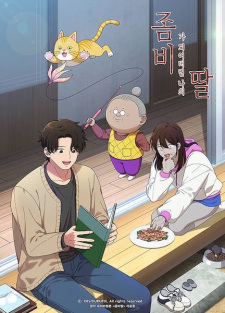

# Trapped in a Dating Sim: The World of Otome Games is Tough for Mobs

## Comentários pessoais
Anime assistido via Crunchyroll. A premissa é a clássica reencarnação com conhecimento prévio, mas ambientada no mundo de um otome game. O protagonista sabe que está dentro de um jogo e tenta sobreviver sem chamar atenção (ser um "mob"). O humor é leve e funciona, mas a execução não traz novidades significativas. Dá pra assistir relaxado sem grandes expectativas.

## Como a nota é calculada
* **A história é inteligente:** 5
* **Personagens chamam a atenção:** 5
* **O anime é bem feito:** 6
* **Foge dos clichês:** 3
* **O ritmo não enrola:** 6
* **Quão o final é satisfatório:** 5
* **Boas sacadas:** 4
* **Fator WOW:** 3

## Resumo
Após ser atropelado e morto, o protagonista reencarna em um mundo que é literalmente um otome game. Ciente de que está dentro de uma simulação, ele tenta evitar os eventos do jogo e sobreviver como um personagem comum (mob), enquanto tenta retornar ao mundo real.

## Informações Importantes
* **Título oficial (MAL):** Trapped in a Dating Sim: The World of Otome Games is Tough for Mobs.
* **Título em inglês:** Trapped in a Dating Sim: The World of Otome Games is Tough for Mobs.
* **Fonte:** Light novel (via Kodansha USA).
* **Estúdio:** Silver Link.
* **Temporada:** Primavera 2022.
* **Episódios:** 12 (23 min cada, finalizado).
* **Classificação:** PG-13 — Teens 13 or older.
* **Gênero principal:** Comédia, Sobrenatural, Isekai.
* **Status de transmissão:** Finalizado; disponível no Crunchyroll.
* **Produção:** Silver Link.
* **Licenciadores:** Crunchyroll.
* **Sistema do mundo:** Mundo de otome game com sistema de rotas e finais baseados nas escolhas do protagonista.
* **Ponto-chave:** Protagonista reencarnado que sabe que está em um jogo e tenta sobreviver como mob sem chamar atenção.
* **Observação técnica:** Animação funcional e direta, sem ambições visuais além do básico.

## Links e Conexões
* **Animes similares:** [Mushoku Tensei: Jobless Reincarnation](mushoku-tensei-jobless-reincarnation.md) (reencarnação com conhecimento prévio), [That Time I Got Reincarnated as a Slime](that-time-i-got-reincarnated-as-a-slime.md) (isekai com sistema), [The Exiled Heavy Knight Knows How to Game the System](the-exiled-heavy-knight-knows-how-to-game-the-system.md) (protagonista que usa conhecimento de jogo)
* **Mesmo Estúdio/Diretor:** Estúdio [Silver Link](https://myanimelist.net/anime/provider/160/Silver_Link).
* **Por que te lembra esse:** A premissa de reencarnação com conhecimento prévio em um sistema de jogo lembra Mushoku Tensei e The Exiled Heavy Knight; o humor leve lembra That Time I Got Reincarnated as a Slime.
