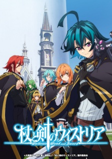

# Tsue to Tsurugi no Wistoria

## Comentários pessoais
Will Serfort é um protagonista atípico num mundo de magia: zero poder mágico, mas determinação absurda e porte físico excepcional. A premissa lembra "o fraco que supera os fortes", mas com espada em vez de magia. Elfaria é absurdamente poderosa (Magia Vander aos 15 anos), o que cria um contraste interessante — ele precisa alcançar o topo da Torre do Mago por pura força e técnica, enquanto ela já está lá naturalmente.

O arco da academia tem ritmo ok, mas o que realmente brilha é o arco final com a invasão dos Celestial Hosts — Will se torna herói justamente por ser o único que pode lutar contra armas que anulam magia. A mensagem é clara: nesse mundo, magia não é tudo.

Estúdio Actas + Bandai Namco Pictures entregam animação consistente, nada espetacular mas funcional. Trilha sonora da Lantis é competente.

## Como a nota é calculada
* **A história é inteligente:** 7/10 — Premissa do underdog funciona bem, mas a fórmula "prova → falha → superação" é previsível. O sistema de Magia Vander é interessante.
* **Personagens chamam a atenção:** 8/10 — Will é carismático e sua determinação é contagiante. Elfaria é carismática apesar de overpowered. Coadjuvantes são ok mas não memoráveis.
* **O anime é bem feito:** 7/10 — Animação sólida, direção competente, nada que tire o fôlego mas também nada que decepcione.
* **Foge dos clichês:** 6/10 — Academia mágica + protagonista sem poder é um território já muito explorado (Mushoku Tensei, The Irregular at Magic High School). A execução salva.
* **O ritmo não enrola:** 8/10 — 12 episódios, sem filler, cada episódio avança a trama. Muito bem ritmado.
* **Quão o final é satisfatório:** 7/10 — Resolve o arco principal de forma satisfatória, mas deixa portas abertas para a 2ª temporada (que já está em exibição).
* **Boas sacadas:** 8/10 — A ideia de que armas anti-mágicas tornam os magos inúteis e o espadachim se torna salvador é muito boa. Inversão de expectativa inteligente.
* **Fator WOW:** 7/10 — As cenas de luta de Will contra magos usando apenas espada e itens mágicos são empolgantes.

## Resumo
Humanidade foi oprimida pelos "Celestial Hosts" até que cinco magos poderosos os derrotaram e criaram uma cúpula mágica para contê-los. Desde então, os cinco magos mais fortes de cada geração — os Magia Vander — monitoram a cúpula no topo da Torre do Mago.

Will Serfort e Elfaria Albis Serfort são amigos de infância que prometeram subir juntos ao topo da torre. Anos depois, Elfaria se tornou a Magia Vander mais jovem da história, enquanto Will... não tem absolutamente nenhuma habilidade mágica. Na Academia de Magia Regarden, ele é desprezado por professores e alunos.

Porém, com seu porte físico excepcional, Will caça monstros no labirinto da academia e vence magos usando apenas espada e alguns itens mágicos. Determinado a cumprir sua promessa, ele se recusa a desistir.

No exame final, Will é injustamente reprovado num teste viciado. Mas quando os Magia Vander realizam o ritual anual de proteção e ficam sem magia, uma horda de monstros invade a academia com armas que anulam magia. Will se torna a única linha de defesa, provando que seu caminho tem valor.

## Informações Importantes
* **Sistema de Magia:** Magos nascem com afinidade natural e absorvem mana. Will é o raro caso de alguém com zero afinidade.
* **Magia Vander:** Os 5 magos mais fortes de cada geração, responsáveis por manter a cúpula que contém os Celestial Hosts.
* **Torre do Mago:** Estrutura onde a cúpula está contida. Só os Magia Vander podem acessar o topo.
* **Celestial Hosts:** Entidades misteriosas que oprimiram a humanidade no passado. A ameaça latente.
* **Armas Anti-Mágicas:** Equipamentos usados pelos monstros na invasão que anulam completamente magia, tornando magos inúteis.
* **2ª Temporada:** Atualmente em exibição (abril–junho 2026), com 12 episódios, focada nos exames finais e na invasão dos Celestial Hosts.

## Links e Conexões
* **Animes similares:** [Jack of All Trades: Party of None](jack-of-all-trades-party-of-none.md) (protagonista espadeiro em mundo de magia, underdog), [Magi: The Kingdom of Magic](magi-the-kingdom-of-magic.md) (shounen de magia com sistema de poder elaborado)
* **Mesmo Estúdio/Diretor:** Actas (estúdio) — também animou "Princess Principal" e "Lord of Vermilion"
* **Por que te lembra esse:** A dinâmica "amigo superpoderoso vs protagonista sem poder que supera com esforço" lembra The Irregular at Magic High School, mas aqui o desequilíbrio é mais dramático e emocional.
