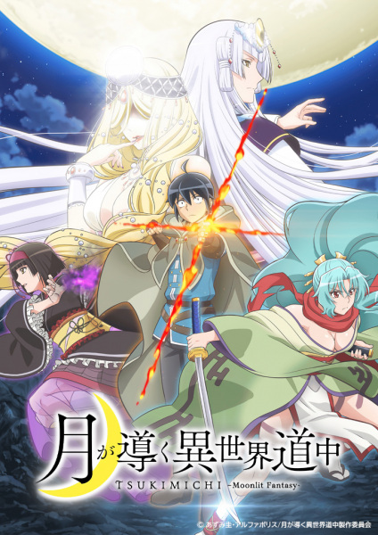

# Tsukimichi: Moonlit Fantasy

## Comentários pessoais
[Anotações]

## Como a nota é calculada
* **A história é inteligente:** 
* **Personagens chamam a atenção:** 
* **O anime é bem feito:** 
* **Foge dos clichês:** 
* **O ritmo não enrola:** 
* **Quão o final é satisfatório:** 
* **Boas sacadas:** 
* **Fator WOW:** 

## Resumo
Makoto Misumi é enviado a outro mundo para se tornar um herói, seguindo um contrato misterioso feito por seus pais com uma deusa anos atrás. No entanto, ao chegar, a deusa o considera "medonho" e revoga seu título de herói, exilando-o para os confins do deserto. Graças à disparidade entre a Terra e este novo mundo, Makoto desperta capacidades físicas e mágicas imensas. Ele passa a construir uma comunidade pacífica com seres míticos e demi-humanos, enquanto ainda busca, contra a proibição da deusa, interagir com outros humanos.

## Informações Importantes
* O anime é uma adaptação de uma série de light novels escrita por Kei Azumi.
* O diferencial de Makoto é sua neutralidade moral e sua capacidade de reunir seres poderosos, criando sua própria facção longe da influência direta da deusa que o baniu.
* A obra mistura humor, exploração e batalhas épicas, com um protagonista que gradualmente entende a política e a cultura desse novo mundo.
* A animação é produzida pelo estúdio C2C.

## Links e Conexões
* **Animes similares:** [That Time I Got Reincarnated as a Slime](that-time-i-got-reincarnated-as-a-slime.md), [Overlord](overlord.md)
* **Mesmo Estúdio/Diretor:** Estúdio [C2C](c2c.md)
* **Por que te lembra esse:** Pela progressão de um protagonista Isekai que constrói um "reino" próprio com aliados poderosos, equilibrando comédia e ação.
