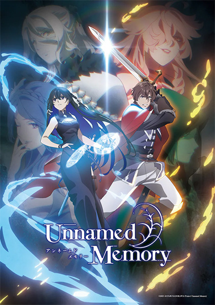

# Unnamed Memory

## Comentários pessoais
[Anotações]

## Como a nota é calculada
* **A história é inteligente:** 
* **Personagens chamam a atenção:** 
* **O anime é bem feito:** 
* **Foge dos clichês:** 
* **O ritmo não enrola:** 
* **Quão o final é satisfatório:** 
* **Boas sacadas:** 
* **Fator WOW:** 

## Resumo
Desde a infância, o príncipe Oscar foi amaldiçoado pela Bruxa do Silêncio, tornando impossível para qualquer mulher dar-lhe um herdeiro. Após 15 anos em busca de uma cura, ele decide enfrentar os desafios da Torre Azul para solicitar a ajuda de Tinasha, a fada bruxa da Lua Azul. Ao chegar ao topo, Oscar propõe que ela se case com ele. Embora inicialmente rejeitado, eles chegam a um acordo: Tinasha viverá com o príncipe por um ano, enquanto buscam uma maneira de desfazer a maldição, unindo seus destinos em uma jornada marcada por segredos do passado.

## Informações Importantes
* O anime é baseado na série de light novels escrita por Kuji Furumiya.
* A dinâmica entre o príncipe que busca redenção e uma bruxa de séculos de idade cria um tom de romance maduro e contemplativo.
* A produção é assinada pelo estúdio ENGI.
* O enredo explora os mistérios em torno da maldição de Oscar e as repercussões da aparição de Tinasha no reino.

## Links e Conexões
* **Animes similares:** [The Ancient Magus' Bride](the-ancient-magus-bride.md), [Frieren: Beyond Journey's End](frieren-beyond-journeys-end.md)
* **Mesmo Estúdio/Diretor:** Estúdio [ENGI](engi.md)
* **Por que te lembra esse:** Pela atmosfera de fantasia clássica focada no desenvolvimento do relacionamento entre personagens com origens e idades muito distintas.
