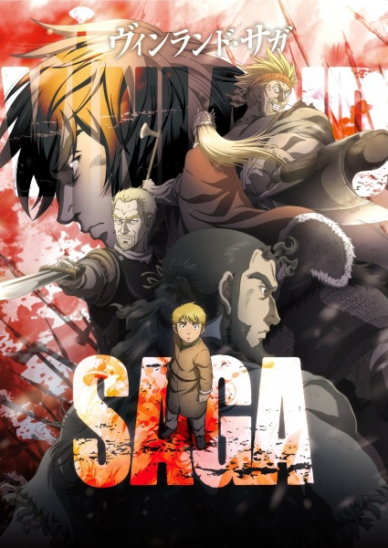

     1|     1|     1|---
     2|     2|     2|titulo: Vinland Saga
     3|     3|     3|titulo_original: ヴィンランド・サガ (Vinrando Saga)
     4|     4|     4|ano: "2019"
     5|     5|     5|genero:
     6|     6|     6|  - Ação
     7|     7|     7|  - Aventura
     8|     8|     8|  - Drama
     9|     9|     9|  - Histórico
    10|    10|    10|tags:
    11|    11|    11|  - vikings
    12|    12|    12|  - vingança
    13|    13|    13|  - filosofia
    14|    14|    14|  - desenvolvimento-pessoal
    15|    15|    15|  - seinen
    16|    16|    16|status: Assistido parcialmente
    17|    17|    17|assistido: ""
    18|    18|    18|nota final: ""
    19|    19|    19|link_referencia: https://myanimelist.net/anime/37521/Vinland_Saga
    20|    20|    20|veredito_rapido: ""
    21|    21|    21|---
    22|    22|    22|
    23|    23|    23|# Vinland Saga
    24|    24|    24|
    25|    25|    25|
    26|    26|    26|
    27|    27|    27|## Comentários pessoais
    28|    28|    28|[Anotações baseadas na nossa conversa. O que você mais achou, o que odiou, momentos marcantes]
    29|    29|    29|
    30|    30|    30|## Como a nota é calculada
    31|    31|    31|* **A história é inteligente:** 
    32|    32|    32|* **Personagens chamam a atenção:** 
    33|    33|    33|* **O anime é bem feito:** 
    34|    34|    34|* **Foge dos clichês:** 
    35|    35|    35|* **O ritmo não enrola:** 
    36|    36|    36|* **Quão o final é satisfatório:** 
    37|    37|    37|* **Boas sacadas:** 
    38|    38|    38|* **Fator WOW:** 
    39|    39|    39|
    40|    40|    40|## Resumo
    41|    41|    41|Baseado na era dos vikings e na invasão da Inglaterra pela Dinamarca (séc. XI), a história acompanha Thorfinn, um garoto criado ouvindo as lendas sobre "Vinland", uma terra distante, fértil e livre da guerra. Porém, após seu pai (o outrora lendário guerreiro Thors) ser assassinado de forma desonrosa pelo líder mercenário Askeladd, Thorfinn é consumido pelo ódio. Curiosamente, ele se junta ao próprio bando de Askeladd, aceitando cumprir as missões mais suicidas na guerra em troca de duelos justos contra o assassino de seu pai. Ao longo de anos banhado em sangue, o jovem buscará vingança enquanto o anime explora brutalmente o sentido da vida, a guerra e o que significa ser um "verdadeiro guerreiro".
    42|    42|    42|
    43|    43|    43|## Informações Importantes
    44|    44|    44|* **O "Verdadeiro Guerreiro":** O grande tema filosófico da obra, deixado pelo pai de Thorfinn: "Você não tem inimigos. Ninguém tem nenhum inimigo. Não existe uma única pessoa no mundo que seja aceitável machucar."
    45|    45|    45|* **Askeladd:** O antagonista da primeira temporada. Um líder mercenário pragmático, brilhante, carismático e incrivelmente complexo. Ele não é apenas um assassino, mas um estrategista de nível político altíssimo.
    46|    46|    46|* **Ambientação Histórica:** Muito fundamentada em personagens reais e na cultura nórdica, explorando o peso real da morte, da escravidão e da crueldade viking (sem o filtro romantizado de Hollywood).
    47|    47|    47|* **Vinland:** A terra mítica (provavelmente a América do Norte moderna) que serve como metáfora para a paz absoluta, a redenção e a saída de um mundo de violência cíclica.
    48|    48|    48|
    49|    49|    49|## Links e Conexões
    50|    50|    50|* **Animes similares:** [[Monster]], [[Attack on Titan]]
    51|    51|    51|* **Mesmo Estúdio/Diretor:** Estúdio [[Wit Studio]] (Temporada 1) / [[MAPPA]] (Temporada 2)
    52|    52|    52|* **Por que te lembra esse:** A profundidade filosófica de Monster combinada com a guerra e o estúdio de Attack on Titan. Askeladd também possui as sacadas políticas geniais de um Lelouch.