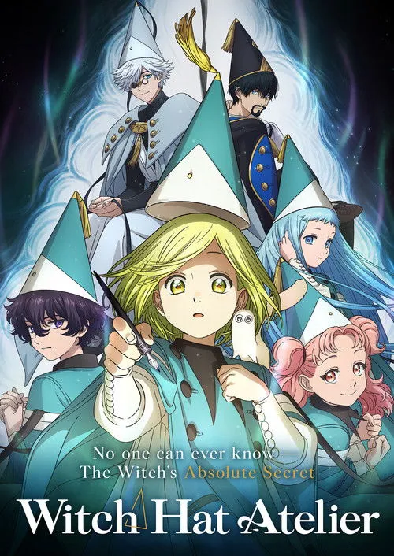

# Witch Hat Atelier

## Comentários pessoais
[Anotações]

## Como a nota é calculada
* **A história é inteligente:** 
* **Personagens chamam a atenção:** 
* **O anime é bem feito:** 
* **Foge dos clichês:** 
* **O ritmo não enrola:** 
* **Quão o final é satisfatório:** 
* **Boas sacadas:** 
* **Fator WOW:** 

## Resumo
Em um mundo onde a magia é realizada por bruxas e feiticeiros através de palavras místicas inscritas em giz, a jovem Coco é uma simples costureira que sempre sonhou em se tornar uma usuária de magia. Após um encontro inesperado com uma bruxa misteriosa chamada Qifrey, Coco é inadvertidamente envolvida em um incidente mágico que transforma sua mãe em pedra. Para desfazer o feitiço, ela se torna aprendiz no Atelier (estúdio) de Qifrey, onde aprende os fundamentos da magia de giz. Enquanto explora os mistérios do mundo mágico, Coco descobre que a magia não é apenas uma ferramenta, mas uma responsabilidade perigosa, especialmente com a existência de magia proibida e organizações sombrias que buscam controlar o conhecimento arcano. Ao lado de outras aprendizes — Agott, Richeh, Tetia e Alaira — Coco embarca em uma jornada de crescimento, descobertas e perigos ocultos no mundo da alta magia.

## Informações Importantes
* A magia neste universo é praticada através de "Grimoires" (livros de feitiços) e giz mágico, onde apenas aqueles com a aptidão inata podem se tornar usuários de magia (bruxos).
* Existem diferentes ramos de magia: Magia de Inverter (que desfaz feitiços), Magia de Cura, Magia de Ilusão e Magia de Batalha, cada uma com suas próprias regras e especializações.
* A organização que regula a magia proíbe certos conhecimentos e técnicas (magia proibida), mantendo um controle rigoroso sobre o que pode ser ensinado aos aprendizes.
* O "Pacto de Sangue" é um conceito crítico onde bruxos renunciam a parte de sua humanidade ou memórias em troca de poder mágico supremo, um tema recorrente que assombra a mente de Qifrey.
* O Atelier funciona como uma escola não tradicional, onde os alunos aprendem na prática, enfrentando testes reais e perigosos que muitas vezes ultrapassam o escopo acadêmico.

## Links e Conexões
* **Animes similares:** [Little Witch Academia](little-witch-academia.md), [Flying Witch](flying-witch.md), [Mahou Shoujo ni Akogarete](mahoushoujo-ni-akogarete.md)
* **Mesmo Estúdio/Diretor:** Estúdio Bug Films, direção de Hiroshi Ikehata
* **Por que te lembra esse:** Compartilham a temática de aprendizado mágico com uma abordagem visual encantadora, mundo rico em regras de magia detalhadas e foco no crescimento de jovens aprendizes em um ambiente escolar/não convencional.
